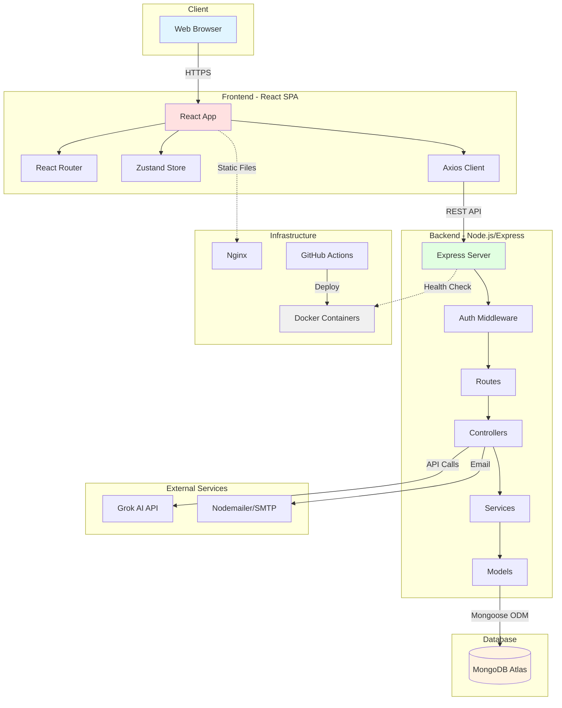
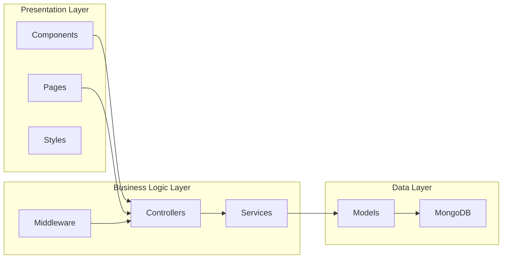
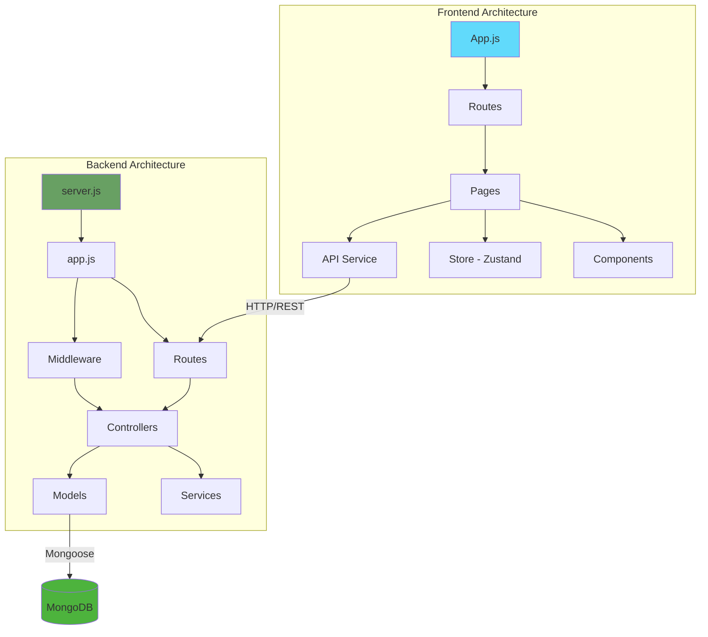
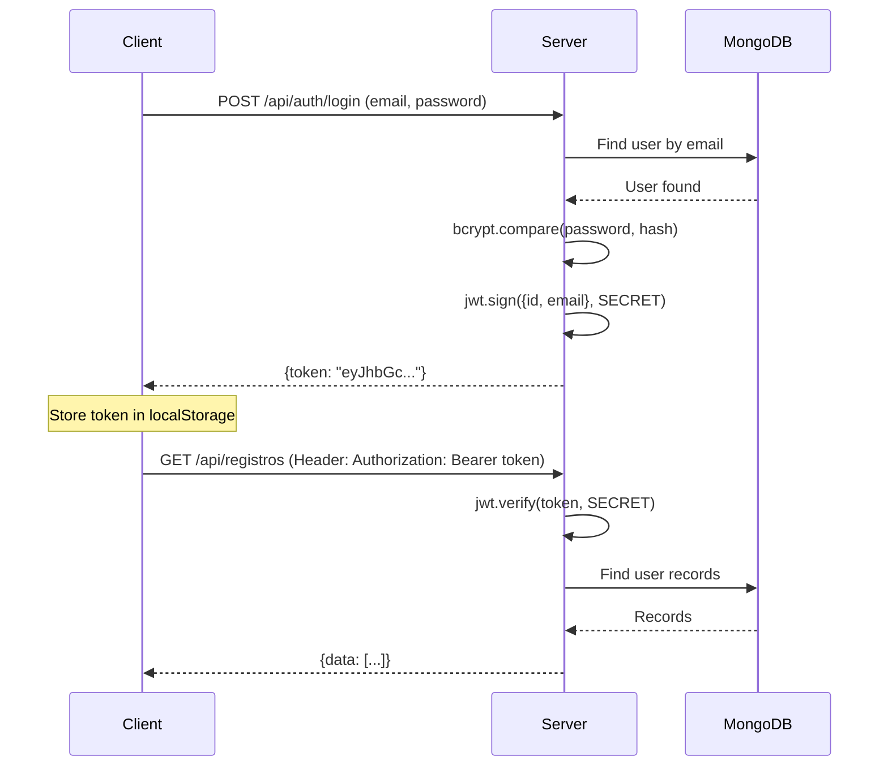
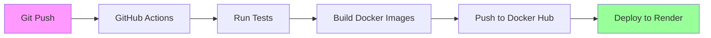
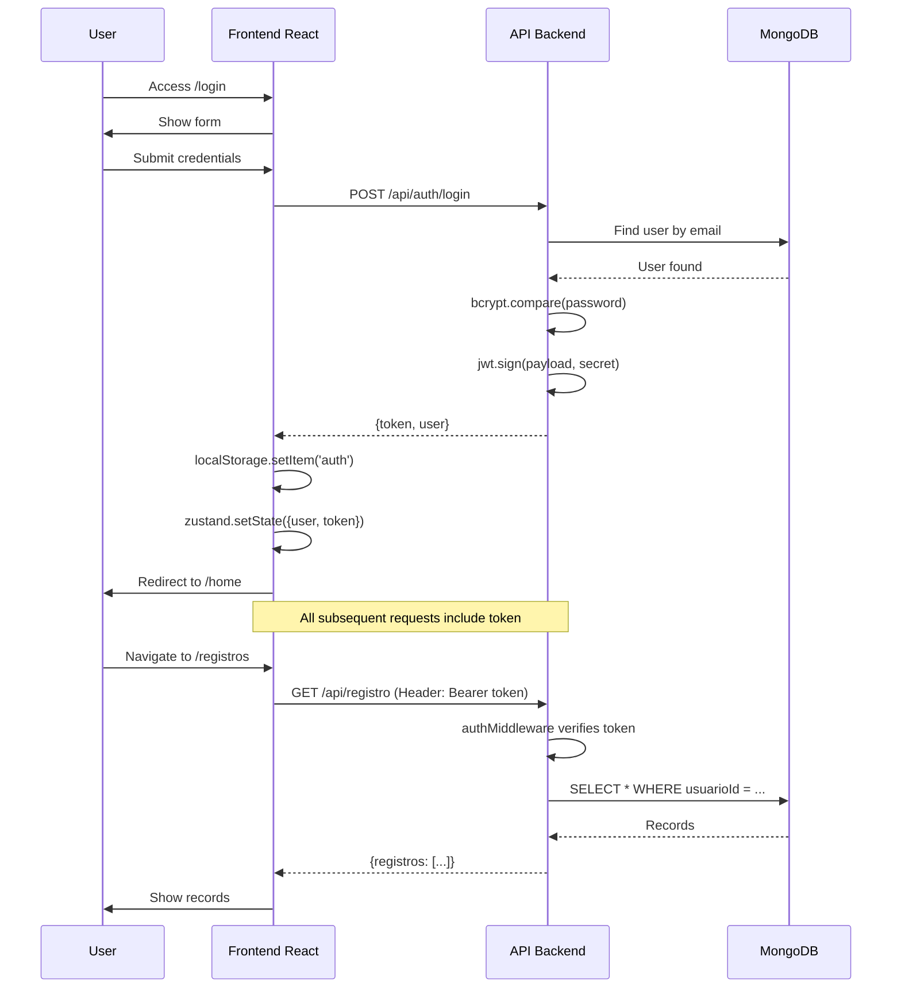
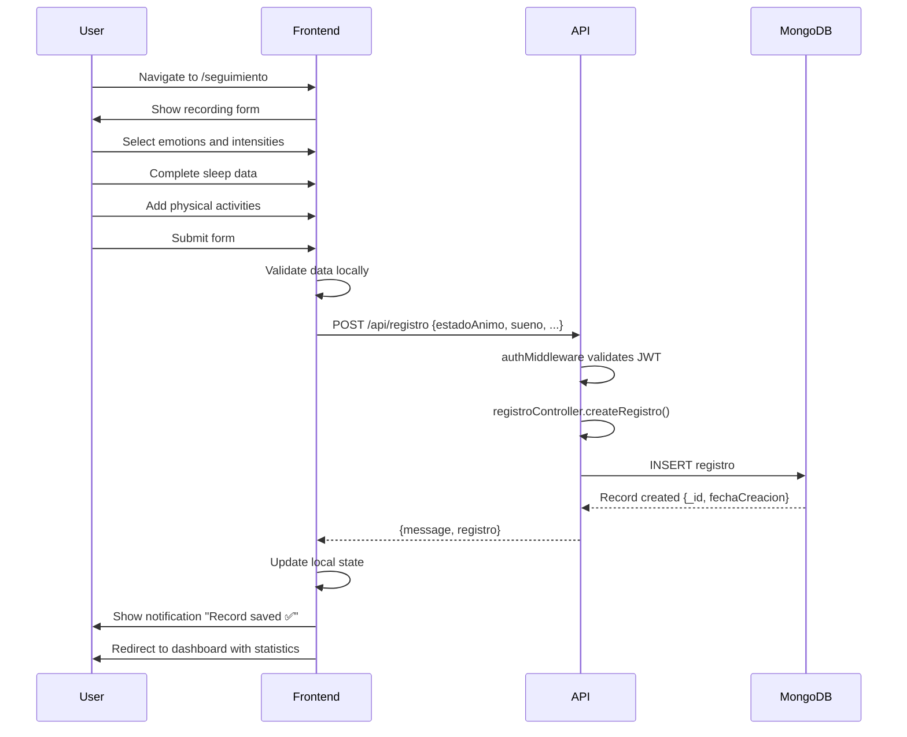
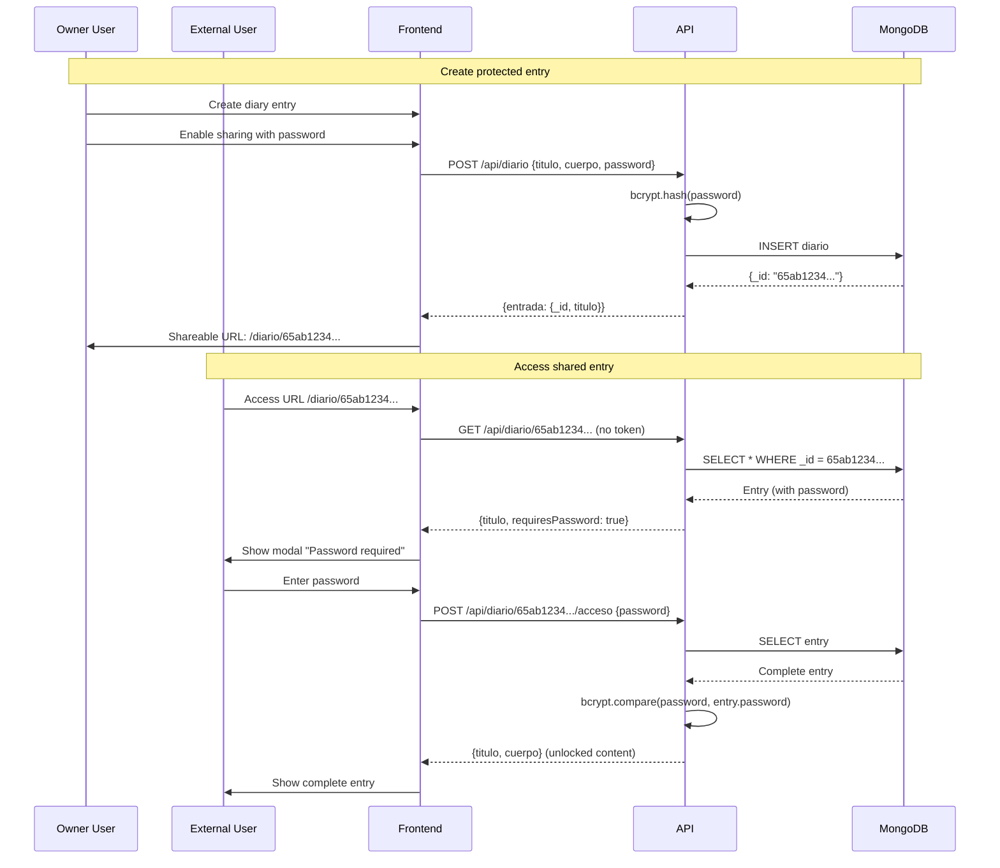

a# MindCare Architecture

**Date:** February 13, 2026  
**Version:** 1.0  
**Project:** MindCare - Mental Health Application

---

## 📑 Table of Contents

- [1. Overview](#1-overview)
- [2. System Architecture](#2-system-architecture)
  - [2.1 General Architecture Diagram](#21-general-architecture-diagram)
  - [2.2 Layered Architecture](#22-layered-architecture)
  - [2.3 Component Diagram](#23-component-diagram)
- [3. Technical Decisions](#3-technical-decisions)
  - [3.1 Technology Stack](#31-technology-stack)
  - [3.2 Architectural Patterns](#32-architectural-patterns)
  - [3.3 Security](#33-security)
  - [3.4 Database](#34-database)
  - [3.5 Infrastructure and Deployment](#35-infrastructure-and-deployment)
- [4. Data Model](#4-data-model)
  - [4.1 Entity-Relationship Diagram](#41-entity-relationship-diagram)
  - [4.2 MongoDB Schemas](#42-mongodb-schemas)
- [5. API Endpoints](#5-api-endpoints)
  - [5.1 Authentication](#51-authentication)
  - [5.2 Initial Form](#52-initial-form)
  - [5.3 Daily Records](#53-daily-records)
  - [5.4 Personal Diary](#54-personal-diary)
  - [5.5 Emergency Contacts](#55-emergency-contacts)
  - [5.6 AI Analysis](#56-ai-analysis)
  - [5.7 Health Check](#57-health-check)
- [6. Data Flows](#6-data-flows)
  - [6.1 Authentication Flow](#61-authentication-flow)
  - [6.2 Emotion Recording Flow](#62-emotion-recording-flow)
  - [6.3 Shared Diary Flow](#63-shared-diary-flow)
- [7. Scalability Considerations](#7-scalability-considerations)
- [8. Monitoring and Logging](#8-monitoring-and-logging)

---

## 1. Overview

MindCare is a full-stack web application designed for mental health tracking and management. The architecture follows the **MERN Stack** pattern (MongoDB, Express.js, React, Node.js) with a clear separation between frontend and backend, implementing modern and scalable design principles.

### Key Features:
- **Microservices Architecture**: Decoupled frontend and backend
- **JWT Authentication**: Stateless and secure authentication system
- **NoSQL Database**: MongoDB Atlas for flexibility and scalability
- **Containerization**: Docker for consistent deployment
- **CI/CD**: GitHub Actions for continuous integration and deployment
- **RESTful API**: Well-defined and documented interfaces

---

## 2. System Architecture

### 2.1 General Architecture Diagram



### 2.2 Layered Architecture

The application follows a 3-layer architecture:



**Responsibilities per layer:**

| Layer | Responsibility | Technologies |
|------|----------------|-------------|
| **Presentation** | User interface, interaction, visualization | React, CSS, React Router |
| **Business Logic** | Data processing, validation, authentication | Express.js, JWT, bcryptjs |
| **Data** | Persistence, queries, models | MongoDB, Mongoose |

### 2.3 Component Diagram



---

## 3. Technical Decisions

### 3.1 Technology Stack

#### **Frontend**

| Technology | Version | Justification |
|------------|---------|---------------|
| **React** | 18.2.0 | Modern framework, reusable components, large ecosystem |
| **React Router DOM** | 6.20.0 | Declarative navigation, support for protected routes |
| **Zustand** | 5.0.8 | Lightweight global state, less boilerplate than Redux |
| **Axios** | 1.6.2 | HTTP client with interceptors, better error handling |
| **React Hot Toast** | 2.6.0 | Elegant and customizable notifications |

**React Justification:**
- ✅ Familiar learning curve for the team
- ✅ Virtual DOM for optimized performance
- ✅ Mature ecosystem with abundant libraries
- ✅ Hooks for reusable logic
- ✅ Create React App for quick start

**Zustand vs Redux Justification:**
- ✅ Less boilerplate code (60% reduction)
- ✅ Simpler and more intuitive API
- ✅ Better performance in re-renders
- ✅ Smaller bundle size (2.9kb vs 15kb)
- ✅ Integrated persistence with `persist` middleware

#### **Backend**

| Technology | Version | Justification |
|------------|---------|---------------|
| **Node.js** | ≥14.0.0 | Asynchronous JavaScript runtime, scalable performance |
| **Express.js** | 4.16.1 | Minimalist framework, flexible middleware |
| **MongoDB** | 8.0.3 | NoSQL, flexible schemas, horizontal scalability |
| **Mongoose** | 8.0.3 | Elegant ODM, schema validation, middleware |
| **JWT** | 9.0.2 | Stateless authentication, secure, industry standard |
| **bcryptjs** | 2.4.3 | Secure password hashing, rainbow table resistant |
| **Helmet** | 7.1.0 | HTTP security headers |
| **CORS** | 2.8.5 | Cross-origin access control |

**MongoDB Justification:**
- ✅ Flexible schema for variable mental health data
- ✅ MongoDB Atlas for free cloud hosting
- ✅ Powerful aggregations for statistics
- ✅ Native horizontal scalability
- ✅ Native JSON (BSON) compatible with JavaScript

#### **DevOps**

| Tool | Purpose |
|-------------|-----------|
| **Docker** | Containerization, consistent environments |
| **Docker Compose** | Local service orchestration |
| **GitHub Actions** | Automated CI/CD |
| **Render** | Production hosting (alternative: Railway) |
| **MongoDB Atlas** | Database as a service |

### 3.2 Architectural Patterns

#### **MVC Pattern (Model-View-Controller)**

```
Backend Structure:
├── Models       → Data schemas (Mongoose)
├── Views        → Templates (Pug) - minimal use
├── Controllers  → Business logic
└── Routes       → Endpoint definition
```

**Advantages:**
- Separation of concerns
- More maintainable code
- Facilitates unit testing
- Component reusability

#### **Repository Pattern**

Mongoose models act as repositories:
- Data layer abstraction
- Centralized queries
- Easy migration to another DB if needed

#### **Middleware Chain**

```javascript
Request → CORS → Helmet → Auth Middleware → Route Handler → Response
```

#### **Component-Based Architecture (Frontend)**

```
src/
├── components/
│   ├── atoms/       → Basic buttons, inputs
│   ├── molecules/   → Forms, cards
│   └── organisms/   → Complex navbar, sidebars
├── pages/           → Complete views
└── store/           → Global state
```

Following Brad Frost's **Atomic Design**.

### 3.3 Security

#### **JWT Authentication**

**Authentication flow:**



**JWT Configuration:**
- **Algorithm:** HS256 (HMAC-SHA256)
- **Expiration:** 7 days (configurable via `JWT_EXPIRES_IN`)
- **Secret:** Minimum 32 characters, stored in environment variable
- **Storage:** `localStorage` in frontend with Zustand persistence

**Implemented security measures:**

| Measure | Implementation | File |
|--------|----------------|---------|
| **Password Hashing** | bcryptjs with 10 rounds | `usuarios_mongoose.js` |
| **JWT Validation** | Middleware that verifies token | `authMiddleware.js` |
| **CORS** | Whitelist of allowed origins | `app.js` |
| **Helmet** | HTTP security headers | `app.js` |
| **Input Validation** | Mongoose schema validation | `models/*.js` |
| **Environment Variables** | Secrets in non-versioned `.env` | `.env.example` |
| **HTTPS** | Mandatory in production | `nginx.conf` |
| **Rate Limiting** | (Pending) Express rate limit | - |

#### **Personal Diary Protection**

Unique feature: diary entries with **double security layer**:

1. **User authentication** (JWT)
2. **Optional password per entry** (bcrypt)

```javascript
// Public but protected entry
{
  "titulo": "My special day",
  "cuerpo": "Private content...",
  "password": "hashedPassword123",
  "usuarioId": "507f1f77bcf86cd799439011"
}
```

Allows sharing public links (`/diario/:id`) that require password to access.

### 3.4 Database

#### **MongoDB Schema Design**

**Applied principles:**
- **Embedding** for one-to-few related data (e.g., emotions within records)
- **Referencing** for one-to-many related data (e.g., user → records)
- **Indexes** on frequently queried fields (`usuarioId`, `fecha`)

**Normalization strategy:**
```
User (1) ───< (N) Records
User (1) ───< (N) Diary Entries
User (1) ───< (N) Emergency Contacts
User (1) ──── (1) Initial Form
```

#### **Optimizations**

| Technique | Implementation |
|---------|----------------|
| **Indexes** | `usuarioId`, `fechaCreacion`, `email` (unique) |
| **Lean Queries** | `.lean()` for reads without Mongoose methods |
| **Projection** | Select only necessary fields |
| **Aggregation Pipeline** | Statistics and charts (future) |

### 3.5 Infrastructure and Deployment

#### **Container Architecture**

```yaml
services:
  backend:
    - Node.js app
    - Port 4000
    - Connects to MongoDB Atlas
    
  frontend:
    - React build + Nginx
    - Port 3000 (dev) / 80 (prod)
    - Serves static files
```

**Docker Advantages:**
- ✅ Identical environment in development and production
- ✅ Easy onboarding for new developers
- ✅ Dependency isolation
- ✅ Deploy with one command: `docker-compose up`

#### **CI/CD Pipeline**



**GitHub Actions workflows:**
- `build-and-test.yml` - Automated testing
- `docker-build-push.yml` - Build and push images
- `deploy.yml` - Production deployment

**Deployment strategy:**
- **Staging:** Automatic on each push to `develop`
- **Production:** Manual trigger from `main`
- **Rollback:** Revert to previous image on Docker Hub

---

## 4. Data Model

### 4.1 Entity-Relationship Diagram

```mermaid
erDiagram
    USERS ||--o{ RECORDS : "has"
    USERS ||--o{ DIARY : "writes"
    USERS ||--o{ EMERGENCY_CONTACTS : "has"
    USERS ||--|| INITIAL_FORM : "completes"
    
    USERS {
        ObjectId _id PK
        string nombre
        string email UK
        string password
        string alias
        boolean formularioCompletado
        boolean contactoEmergenciaAnadido
        timestamp createdAt
        timestamp updatedAt
    }
    
    RECORDS {
        ObjectId _id PK
        ObjectId usuarioId FK
        date fechaCreacion
        object estadoAnimo
        object sueno
        array actividadFisica
        object alimentacion
        object interaccionesSociales
        array cognicion
        string sintomas
        string notasAdicionales
    }
    
    DIARY {
        ObjectId _id PK
        ObjectId usuarioId FK
        string titulo
        string cuerpo
        string password
        timestamp createdAt
        timestamp updatedAt
    }
    
    EMERGENCY_CONTACTS {
        ObjectId _id PK
        ObjectId usuarioId FK
        string nombre
        string relacion
        string telefono
        string email
        boolean notificarEmergencia
        timestamp createdAt
        timestamp updatedAt
    }
    
    INITIAL_FORM {
        ObjectId _id PK
        ObjectId usuarioId FK UK
        object factoresDetonantes
        object actividadesPlacenteras
        string comentariosDetonantes
        string comentariosActividades
        timestamp createdAt
        timestamp updatedAt
    }
```

### 4.2 MongoDB Schemas

#### **Users**

```javascript
{
  "_id": ObjectId,
  "nombre": String (required, min: 2),
  "email": String (required, unique, lowercase),
  "password": String (required, hashed, min: 8),
  "alias": String (optional),
  "formularioCompletado": Boolean (default: false),
  "contactoEmergenciaAnadido": Boolean (default: false),
  "createdAt": ISODate,
  "updatedAt": ISODate
}
```

**Indexes:**
- `email`: unique index
- `createdAt`: for temporal queries

**Validations:**
- Email: regex `/\S+@\S+\.\S+/`
- Password: minimum 8 characters (before hash)
- Name: minimum 2 characters

#### **Daily Records**

```javascript
{
  "_id": ObjectId,
  "usuarioId": ObjectId (ref: 'User'),
  "fechaCreacion": Date (default: now),
  "estadoAnimo": {
    "emociones": [{
      "nombre": String (enum: ['Bien', 'Feliz', 'Triste', 'Rabia', 'Ansiedad', ...]),
      "intensidad": Number (1-5)
    }],
    "comentario": String
  },
  "sueno": {
    "horaInicioSueno": String,
    "horaDespertar": String,
    "dificultadDormir": Boolean,
    "despertaresNocturnos": Boolean,
    "cansancioDespertar": Boolean,
    "suenoNoReparador": Boolean,
    "suenosVividos": Boolean,
    "notasSueno": String
  },
  "actividadFisica": [{
    "nombre": String,
    "duracion": Number (minutes),
    "intensidad": String (enum: ['baja', 'moderada', 'alta'])
  }],
  "alimentacion": {
    "regularidadComidas": String,
    "calidadDieta": {
      "frutasVerduras": Boolean,
      "ultraprocesados": Boolean,
      "azucar": Boolean,
      "cafeina": Boolean,
      "alcohol": Boolean
    },
    "apetito": String (enum: ['disminuido', 'normal', 'aumentado'])
  },
  "interaccionesSociales": {
    "cantidad": String (enum: ['sociable', 'introvertido']),
    "calidad": String (enum: ['apoyo', 'conflicto']),
    "notasSociales": String
  },
  "cognicion": [{
    "nombre": String (enum: ['Poca memoria', 'Concentración', 'Estrés', ...]),
    "intensidad": Number (1-5)
  }],
  "sintomas": String,
  "notasAdicionales": String
}
```

**Indexes:**
- Compound index: `{usuarioId: 1, fechaCreacion: -1}`
- For efficient user record queries ordered by date

#### **Personal Diary**

```javascript
{
  "_id": ObjectId,
  "usuarioId": ObjectId (ref: 'User'),
  "titulo": String (required),
  "cuerpo": String (required),
  "password": String (optional, hashed),
  "createdAt": ISODate,
  "updatedAt": ISODate
}
```

**Special features:**
- Optional password for sharing entries
- Pre-save hook to hash password
- `compararPassword(candidate)` method for verification

#### **Initial Form**

```javascript
{
  "_id": ObjectId,
  "usuarioId": ObjectId (ref: 'User', unique),
  "factoresDetonantes": {
    "relaciones": [{ opcion: String, intensidad: Number(1-5) }],
    "trabajoEstudio": [{ opcion: String, intensidad: Number(1-5) }],
    "rutinaHabitos": [{ opcion: String, intensidad: Number(1-5) }],
    "emociones": [{ opcion: String, intensidad: Number(1-5) }],
    "estimulosExternos": [{ opcion: String, intensidad: Number(1-5) }],
    "saludFisica": [{ opcion: String, intensidad: Number(1-5) }]
  },
  "actividadesPlacenteras": {
    "actividadFisica": [{ opcion: String, preferencia: Number(1-5) }],
    "social": [{ opcion: String, preferencia: Number(1-5) }],
    "creatividadHobbies": [{ opcion: String, preferencia: Number(1-5) }],
    "cuidadoPersonal": [{ opcion: String, preferencia: Number(1-5) }],
    "entretenimiento": [{ opcion: String, preferencia: Number(1-5) }],
    "logroAprendizaje": [{ opcion: String, preferencia: Number(1-5) }]
  },
  "comentariosDetonantes": String,
  "comentariosActividades": String,
  "createdAt": ISODate,
  "updatedAt": ISODate
}
```

**Purpose:**
- Personalized onboarding
- Basis for AI recommendations
- Once per user (unique constraint)

#### **Emergency Contacts**

```javascript
{
  "_id": ObjectId,
  "usuarioId": ObjectId (ref: 'User'),
  "nombre": String (required),
  "relacion": String,
  "telefono": String (required),
  "email": String,
  "notificarEmergencia": Boolean (default: true),
  "createdAt": ISODate,
  "updatedAt": ISODate
}
```

---

## 5. API Endpoints

**Base URL:** `http://localhost:4000/api` (development)  
**Base URL:** `https://api.mindcare.com/api` (production)

### 5.1 Authentication

#### `POST /api/auth/register`

Registers a new user.

**Headers:**
```
Content-Type: application/json
```

**Request Body:**
```json
{
  "nombre": "María García",
  "email": "maria@ejemplo.com",
  "password": "MiPassword123!",
  "alias": "Mari" (optional)
}
```

**Response 201 - Created:**
```json
{
  "message": "Usuario registrado exitosamente",
  "user": {
    "_id": "507f1f77bcf86cd799439011",
    "nombre": "María García",
    "email": "maria@ejemplo.com",
    "alias": "Mari",
    "formularioCompletado": false,
    "contactoEmergenciaAnadido": false,
    "createdAt": "2026-02-13T10:00:00.000Z"
  }
}
```

**Errors:**
- `400` - Email already registered
- `400` - Incorrect validation data

---

#### `POST /api/auth/login`

Authenticates user and returns JWT.

**Headers:**
```
Content-Type: application/json
```

**Request Body:**
```json
{
  "email": "maria@ejemplo.com",
  "password": "MiPassword123!"
}
```

**Response 200 - OK:**
```json
{
  "token": "eyJhbGciOiJIUzI1NiIsInR5cCI6IkpXVCJ9...",
  "user": {
    "_id": "507f1f77bcf86cd799439011",
    "nombre": "María García",
    "email": "maria@ejemplo.com",
    "alias": "Mari"
  }
}
```

**Errors:**
- `400` - Invalid credentials
- `404` - User not found

---

#### `GET /api/auth/profile`

Gets authenticated user profile. **🔒 Requires authentication**

**Headers:**
```
Authorization: Bearer <token>
```

**Response 200 - OK:**
```json
{
  "_id": "507f1f77bcf86cd799439011",
  "nombre": "María García",
  "email": "maria@ejemplo.com",
  "alias": "Mari",
  "formularioCompletado": true,
  "contactoEmergenciaAnadido": true,
  "createdAt": "2026-02-13T10:00:00.000Z"
}
```

**Errors:**
- `401` - Invalid or expired token
- `404` - User not found

---

### 5.2 Initial Form

#### `POST /api/formulario`

Creates or updates user's initial form. **🔒 Requires authentication**

**Headers:**
```
Authorization: Bearer <token>
Content-Type: application/json
```

**Request Body:**
```json
{
  "factoresDetonantes": {
    "relaciones": [
      { "opcion": "Conflicto con familiares", "intensidad": 4 }
    ],
    "emociones": [
      { "opcion": "Ansiedad", "intensidad": 5 }
    ]
  },
  "actividadesPlacenteras": {
    "actividadFisica": [
      { "opcion": "Yoga", "preferencia": 5 }
    ],
    "creatividadHobbies": [
      { "opcion": "Escribir", "preferencia": 4 }
    ]
  },
  "comentariosDetonantes": "Me siento ansioso en situaciones sociales",
  "comentariosActividades": "Disfruto actividades relajantes"
}
```

**Response 201 - Created:**
```json
{
  "message": "Formulario guardado exitosamente",
  "formulario": {
    "_id": "65a8f123...",
    "usuarioId": "507f1f77...",
    "factoresDetonantes": { ... },
    "actividadesPlacenteras": { ... },
    "createdAt": "2026-02-13T11:00:00.000Z"
  }
}
```

---

#### `GET /api/formulario`

Gets user's form. **🔒 Requires authentication**

**Headers:**
```
Authorization: Bearer <token>
```

**Response 200 - OK:**
```json
{
  "_id": "65a8f123...",
  "usuarioId": "507f1f77...",
  "factoresDetonantes": { ... },
  "actividadesPlacenteras": { ... },
  "comentariosDetonantes": "...",
  "createdAt": "2026-02-13T11:00:00.000Z",
  "updatedAt": "2026-02-13T11:00:00.000Z"
}
```

**Errors:**
- `404` - Form not found

---

### 5.3 Daily Records

#### `POST /api/registro`

Creates a new daily record. **🔒 Requires authentication**

**Headers:**
```
Authorization: Bearer <token>
Content-Type: application/json
```

**Request Body:**
```json
{
  "estadoAnimo": {
    "emociones": [
      { "nombre": "Bien", "intensidad": 4 },
      { "nombre": "Ansiedad", "intensidad": 2 }
    ],
    "comentario": "Día productivo pero con algo de nerviosismo"
  },
  "sueno": {
    "horaInicioSueno": "23:00",
    "horaDespertar": "07:00",
    "dificultadDormir": false,
    "despertaresNocturnos": false,
    "cansancioDespertar": false,
    "notasSueno": "Dormí bien"
  },
  "actividadFisica": [
    { "nombre": "Yoga", "duracion": 30, "intensidad": "baja" }
  ],
  "alimentacion": {
    "regularidadComidas": "regular",
    "calidadDieta": {
      "frutasVerduras": true,
      "ultraprocesados": false,
      "azucar": false,
      "cafeina": true,
      "alcohol": false
    },
    "apetito": "normal"
  },
  "notasAdicionales": "Día tranquilo, sin incidentes"
}
```

**Response 201 - Created:**
```json
{
  "message": "Registro creado exitosamente",
  "registro": {
    "_id": "65a9f456...",
    "usuarioId": "507f1f77...",
    "fechaCreacion": "2026-02-13T14:30:00.000Z",
    "estadoAnimo": { ... },
    "sueno": { ... }
  }
}
```

---

#### `GET /api/registro`

Gets all user records. **🔒 Requires authentication**

**Headers:**
```
Authorization: Bearer <token>
```

**Query Parameters:**
- `limit` (optional): Maximum number of records (default: 50)
- `skip` (optional): Number of records to skip for pagination

**Response 200 - OK:**
```json
{
  "registros": [
    {
      "_id": "65a9f456...",
      "fechaCreacion": "2026-02-13T14:30:00.000Z",
      "estadoAnimo": {
        "emociones": [
          { "nombre": "Bien", "intensidad": 4 }
        ]
      },
      "sueno": { ... }
    }
  ],
  "total": 25,
  "page": 1
}
```

---

#### `GET /api/registro/rango`

Gets records in a date range. **🔒 Requires authentication**

**Headers:**
```
Authorization: Bearer <token>
```

**Query Parameters:**
- `fechaInicio` (required): Start date (ISO 8601)
- `fechaFin` (required): End date (ISO 8601)

**Example:**
```
GET /api/registro/rango?fechaInicio=2026-02-01&fechaFin=2026-02-13
```

**Response 200 - OK:**
```json
{
  "registros": [ ... ],
  "total": 12,
  "fechaInicio": "2026-02-01T00:00:00.000Z",
  "fechaFin": "2026-02-13T23:59:59.000Z"
}
```

---

#### `GET /api/registro/fecha/:fecha`

Gets record for specific date. **🔒 Requires authentication**

**Headers:**
```
Authorization: Bearer <token>
```

**URL Parameters:**
- `fecha`: Date in YYYY-MM-DD format

**Example:**
```
GET /api/registro/fecha/2026-02-13
```

**Response 200 - OK:**
```json
{
  "_id": "65a9f456...",
  "fechaCreacion": "2026-02-13T14:30:00.000Z",
  "estadoAnimo": { ... },
  "sueno": { ... }
}
```

**Errors:**
- `404` - No record for that date

---

#### `GET /api/registro/:id`

Gets a record by ID. **🔒 Requires authentication**

**Headers:**
```
Authorization: Bearer <token>
```

**Response 200 - OK:**
```json
{
  "_id": "65a9f456...",
  "usuarioId": "507f1f77...",
  "fechaCreacion": "2026-02-13T14:30:00.000Z",
  "estadoAnimo": { ... }
}
```

---

### 5.4 Personal Diary

#### `POST /api/diario`

Creates a new diary entry. **🔒 Requires authentication**

**Headers:**
```
Authorization: Bearer <token>
Content-Type: application/json
```

**Request Body:**
```json
{
  "titulo": "A special day",
  "cuerpo": "Today was an amazing day. I felt that I'm finally making progress...",
  "password": "myPassword123" (optional - for protected sharing)
}
```

**Response 201 - Created:**
```json
{
  "message": "Entrada de diario creada exitosamente",
  "entrada": {
    "_id": "65ab1234...",
    "usuarioId": "507f1f77...",
    "titulo": "A special day",
    "cuerpo": "Today was an amazing day...",
    "createdAt": "2026-02-13T15:00:00.000Z",
    "compartible": true
  }
}
```

---

#### `GET /api/diario`

Gets all user diary entries. **🔒 Requires authentication**

**Headers:**
```
Authorization: Bearer <token>
```

**Response 200 - OK:**
```json
{
  "entradas": [
    {
      "_id": "65ab1234...",
      "titulo": "A special day",
      "cuerpo": "Content...",
      "createdAt": "2026-02-13T15:00:00.000Z",
      "hasPassword": true
    }
  ],
  "total": 15
}
```

---

#### `GET /api/diario/:id`

Gets a specific entry. **Optional authentication**

**Headers (optional):**
```
Authorization: Bearer <token>
```

**Response 200 - OK (without password):**
```json
{
  "_id": "65ab1234...",
  "titulo": "A special day",
  "cuerpo": "Full content...",
  "createdAt": "2026-02-13T15:00:00.000Z",
  "updatedAt": "2026-02-13T15:00:00.000Z"
}
```

**Response 200 - OK (with password protected):**
```json
{
  "_id": "65ab1234...",
  "titulo": "A special day",
  "requiresPassword": true,
  "createdAt": "2026-02-13T15:00:00.000Z"
}
```

---

#### `POST /api/diario/:id/acceso`

Access protected entry with password. **Public**

**Headers:**
```
Content-Type: application/json
```

**Request Body:**
```json
{
  "password": "myPassword123"
}
```

**Response 200 - OK:**
```json
{
  "_id": "65ab1234...",
  "titulo": "A special day",
  "cuerpo": "Full unlocked content...",
  "createdAt": "2026-02-13T15:00:00.000Z"
}
```

**Errors:**
- `401` - Incorrect password
- `404` - Entry not found

---

#### `PUT /api/diario/:id`

Updates a diary entry. **🔒 Requires authentication**

**Headers:**
```
Authorization: Bearer <token>
Content-Type: application/json
```

**Request Body:**
```json
{
  "titulo": "Updated title",
  "cuerpo": "Updated content...",
  "password": "newPassword" (optional)
}
```

**Response 200 - OK:**
```json
{
  "message": "Entrada actualizada exitosamente",
  "entrada": {
    "_id": "65ab1234...",
    "titulo": "Updated title",
    "updatedAt": "2026-02-13T16:00:00.000Z"
  }
}
```

**Errors:**
- `403` - Unauthorized (not the owner)
- `404` - Entry not found

---

#### `DELETE /api/diario/:id`

Deletes a diary entry. **🔒 Requires authentication**

**Headers:**
```
Authorization: Bearer <token>
```

**Response 200 - OK:**
```json
{
  "message": "Entrada eliminada exitosamente"
}
```

**Errors:**
- `403` - Unauthorized
- `404` - Entry not found

---

### 5.5 Emergency Contacts

#### `POST /api/contactos-emergencia`

Creates an emergency contact. **🔒 Requires authentication**

**Headers:**
```
Authorization: Bearer <token>
Content-Type: application/json
```

**Request Body:**
```json
{
  "nombre": "Dr. Juan Pérez",
  "relacion": "Therapist",
  "telefono": "+34 123 456 789",
  "email": "juan.perez@therapy.com",
  "notificarEmergencia": true
}
```

**Response 201 - Created:**
```json
{
  "message": "Contacto creado exitosamente",
  "contacto": {
    "_id": "65ac5678...",
    "usuarioId": "507f1f77...",
    "nombre": "Dr. Juan Pérez",
    "relacion": "Therapist",
    "telefono": "+34 123 456 789",
    "email": "juan.perez@therapy.com",
    "notificarEmergencia": true,
    "createdAt": "2026-02-13T16:30:00.000Z"
  }
}
```

---

#### `GET /api/contactos-emergencia`

Gets all user contacts. **🔒 Requires authentication**

**Headers:**
```
Authorization: Bearer <token>
```

**Response 200 - OK:**
```json
{
  "contactos": [
    {
      "_id": "65ac5678...",
      "nombre": "Dr. Juan Pérez",
      "relacion": "Therapist",
      "telefono": "+34 123 456 789",
      "email": "juan.perez@therapy.com",
      "createdAt": "2026-02-13T16:30:00.000Z"
    }
  ],
  "total": 3
}
```

---

#### `GET /api/contactos-emergencia/:id`

Gets a specific contact. **🔒 Requires authentication**

**Headers:**
```
Authorization: Bearer <token>
```

**Response 200 - OK:**
```json
{
  "_id": "65ac5678...",
  "nombre": "Dr. Juan Pérez",
  "relacion": "Therapist",
  "telefono": "+34 123 456 789",
  "email": "juan.perez@therapy.com",
  "notificarEmergencia": true
}
```

---

#### `PUT /api/contactos-emergencia/:id`

Updates a contact. **🔒 Requires authentication**

**Headers:**
```
Authorization: Bearer <token>
Content-Type: application/json
```

**Request Body:**
```json
{
  "nombre": "Dr. Juan Pérez Gómez",
  "telefono": "+34 987 654 321"
}
```

**Response 200 - OK:**
```json
{
  "message": "Contacto actualizado exitosamente",
  "contacto": {
    "_id": "65ac5678...",
    "nombre": "Dr. Juan Pérez Gómez",
    "telefono": "+34 987 654 321",
    "updatedAt": "2026-02-13T17:00:00.000Z"
  }
}
```

---

#### `DELETE /api/contactos-emergencia/:id`

Deletes a contact. **🔒 Requires authentication**

**Headers:**
```
Authorization: Bearer <token>
```

**Response 200 - OK:**
```json
{
  "message": "Contacto eliminado exitosamente"
}
```

---

#### `POST /api/contactos-emergencia/:contactoId/send-email`

Sends emergency email to a contact. **🔒 Requires authentication**

**Headers:**
```
Authorization: Bearer <token>
Content-Type: application/json
```

**Request Body:**
```json
{
  "mensaje": "I need urgent help. Please contact me as soon as possible."
}
```

**Response 200 - OK:**
```json
{
  "message": "Email enviado exitosamente",
  "destinatario": "juan.perez@therapy.com"
}
```

**Errors:**
- `400` - Contact without configured email
- `500` - Error sending email

---

### 5.6 AI Analysis

#### `POST /api/ai/analyze`

Analyzes user data with AI (Grok). **Public or authenticated**

**Headers:**
```
Content-Type: application/json
Authorization: Bearer <token> (optional)
```

**Request Body:**
```json
{
  "registros": [
    {
      "fecha": "2026-02-13",
      "estadoAnimo": { "emociones": [{"nombre": "Triste", "intensidad": 4}] },
      "sueno": { "horaInicioSueno": "02:00", "cansancioDespertar": true }
    }
  ],
  "formulario": {
    "factoresDetonantes": { ... },
    "actividadesPlacenteras": { ... }
  }
}
```

**Response 200 - OK:**
```json
{
  "analisis": {
    "resumen": "Based on your records, we detect an irregular sleep pattern...",
    "patrones": [
      "Irregular sleep over the last 7 nights",
      "Predominant emotions: Sadness, Anxiety",
      "Low physical activity"
    ],
    "recomendaciones": [
      "Establish a consistent sleep routine",
      "Consider practicing Yoga (activity you indicated as pleasant)",
      "Reduce caffeine consumption after 4:00 PM"
    ],
    "alertas": [
      "Worrying sleep pattern detected"
    ]
  },
  "generatedAt": "2026-02-13T18:00:00.000Z"
}
```

**Errors:**
- `400` - Insufficient data for analysis
- `503` - AI service unavailable

---

### 5.7 Health Check

#### `GET /api/health`

Checks service status. **Public**

**Response 200 - OK:**
```json
{
  "status": "ok",
  "message": "API is up and running",
  "timestamp": "2026-02-13T18:30:00.000Z",
  "uptime": 3600,
  "version": "1.0.0"
}
```

---

## 6. Data Flows

### 6.1 Authentication Flow



### 6.2 Emotion Recording Flow



### 6.3 Shared Diary Flow



---

## 7. Scalability Considerations

### Implemented strategies:

#### **Caching**

```javascript
// Example: Article caching in memory
const NodeCache = require('node-cache');
const articulosCache = new NodeCache({ stdTTL: 3600 }); // 1 hour

app.get('/api/articulos', (req, res) => {
  const cached = articulosCache.get('all');
  if (cached) return res.json(cached);
  
  // If no cache, search in DB
  Articulo.find().then(articulos => {
    articulosCache.set('all', articulos);
    res.json(articulos);
  });
});
```

#### **Database indexes**

```javascript
// Indexes for optimization
usuarioSchema.index({ email: 1 }, { unique: true });
registroSchema.index({ usuarioId: 1, fechaCreacion: -1 });
diarioSchema.index({ usuarioId: 1, createdAt: -1 });
```

#### **Pagination**

```javascript
// Example of pagination in records
router.get('/registro', authMiddleware, async (req, res) => {
  const page = parseInt(req.query.page) || 1;
  const limit = parseInt(req.query.limit) || 20;
  const skip = (page - 1) * limit;
  
  const registros = await Registro.find({ usuarioId: req.user.id })
    .sort({ fechaCreacion: -1 })
    .skip(skip)
    .limit(limit)
    .lean(); // .lean() for better performance
  
  const total = await Registro.countDocuments({ usuarioId: req.user.id });
  
  res.json({
    registros,
    pagination: {
      page,
      limit,
      total,
      pages: Math.ceil(total / limit)
    }
  });
});
```

#### **HTTP Compression**

```javascript
// app.js
const compression = require('compression');
app.use(compression());
```

#### **Horizontal scaling**

**Architecture prepared for multiple instances:**

```yaml
# docker-compose.yml with replicas
services:
  backend:
    image: mindcare-backend
    deploy:
      replicas: 3
      resources:
        limits:
          cpus: '0.5'
          memory: 512M
    environment:
      - NODE_ENV=production
```

#### **CDN for static files**

```javascript
// Configuration to serve assets from CDN
const CDN_URL = process.env.CDN_URL || '';

app.use('/static', express.static('public', {
  maxAge: '1y',
  setHeaders: (res, path) => {
    if (path.endsWith('.js') || path.endsWith('.css')) {
      res.setHeader('Cache-Control', 'public, max-age=31536000, immutable');
    }
  }
}));
```

### Current limits and future improvements:

| Current Limit | Future Solution |
|---------------|-----------------|
| MongoDB Atlas Free (512MB) | Scalable M10+ plan with sharding |
| No rate limiting | `express-rate-limit` middleware |
| No workers for heavy tasks | Bull queue with Redis |
| Synchronous AI | Asynchronous jobs with webhooks |
| No CDN | CloudFlare or AWS CloudFront |
| Local logs | Elasticsearch + Kibana / Datadog |

---

## 8. Monitoring and Logging

### Logging System

#### **Morgan (HTTP logging)**

```javascript
// app.js - HTTP request logging
const morgan = require('morgan');

if (process.env.NODE_ENV === 'development') {
  app.use(morgan('dev'));
} else {
  app.use(morgan('combined', {
    stream: {
      write: (message) => logger.info(message.trim())
    }
  }));
}
```

#### **Winston (Application logging)**

```javascript
// utils/logger.js
const winston = require('winston');

const logger = winston.createLogger({
  level: process.env.LOG_LEVEL || 'info',
  format: winston.format.combine(
    winston.format.timestamp(),
    winston.format.errors({ stack: true }),
    winston.format.json()
  ),
  transports: [
    new winston.transports.File({ filename: 'error.log', level: 'error' }),
    new winston.transports.File({ filename: 'combined.log' })
  ]
});

if (process.env.NODE_ENV !== 'production') {
  logger.add(new winston.transports.Console({
    format: winston.format.simple()
  }));
}

module.exports = logger;
```

#### **Usage in controllers**

```javascript
const logger = require('../utils/logger');

exports.createRegistro = async (req, res) => {
  try {
    logger.info(`Creating registro for user ${req.user.id}`);
    // ... logic
  } catch (error) {
    logger.error(`Error creating registro: ${error.message}`, {
      userId: req.user.id,
      stack: error.stack
    });
    res.status(500).json({ message: 'Internal server error' });
  }
};
```

### Health Checks

#### **Health endpoint**

```javascript
// routes/health.routes.js
router.get('/', async (req, res) => {
  const health = {
    status: 'ok',
    timestamp: new Date().toISOString(),
    uptime: process.uptime(),
    version: process.env.npm_package_version
  };
  
  // Check MongoDB connection
  try {
    await mongoose.connection.db.admin().ping();
    health.database = 'connected';
  } catch (error) {
    health.status = 'error';
    health.database = 'disconnected';
    return res.status(503).json(health);
  }
  
  res.json(health);
});
```

#### **Docker healthcheck**

```yaml
# docker-compose.yml
services:
  backend:
    healthcheck:
      test: ["CMD", "wget", "--quiet", "--tries=1", "--spider", "http://localhost:4000/api/health"]
      interval: 30s
      timeout: 10s
      retries: 3
      start_period: 40s
```

### Metrics (future)

**Prometheus integration:**

```javascript
// metrics.js
const prometheus = require('prom-client');

// Custom metrics
const httpRequestDuration = new prometheus.Histogram({
  name: 'http_request_duration_seconds',
  help: 'Duration of HTTP requests in seconds',
  labelNames: ['method', 'route', 'status_code']
});

const registrosCreados = new prometheus.Counter({
  name: 'registros_created_total',
  help: 'Total number of registros created'
});

// Metrics endpoint
app.get('/metrics', (req, res) => {
  res.set('Content-Type', prometheus.register.contentType);
  res.end(prometheus.register.metrics());
});
```

---

## Executive Summary

### Architecture strengths:

✅ **Clear separation of concerns** between frontend and backend  
✅ **Robust security** with JWT, bcrypt, CORS and Helmet  
✅ **Scalability** through Docker containers and MongoDB Atlas  
✅ **Maintainability** with well-structured and documented code  
✅ **Testability** with modular and decoupled architecture  
✅ **Automated CI/CD** with GitHub Actions  
✅ **Well-documented RESTful API** and versionable  

### Identified areas for improvement:

🔄 Implement rate limiting to prevent abuse  
🔄 Add workers for asynchronous tasks (emails, AI analysis)  
🔄 Migrate to TypeScript for type safety  
🔄 Implement automated testing (Jest, React Testing Library)  
🔄 Add WebSockets for real-time notifications  
🔄 Configure CDN for static assets  
🔄 Implement metrics system with Prometheus  

---

**Document generated on:** February 13, 2026  
**Last update:** February 13, 2026  
**Version:** 1.0  
**Team:** MindCare Development Team
