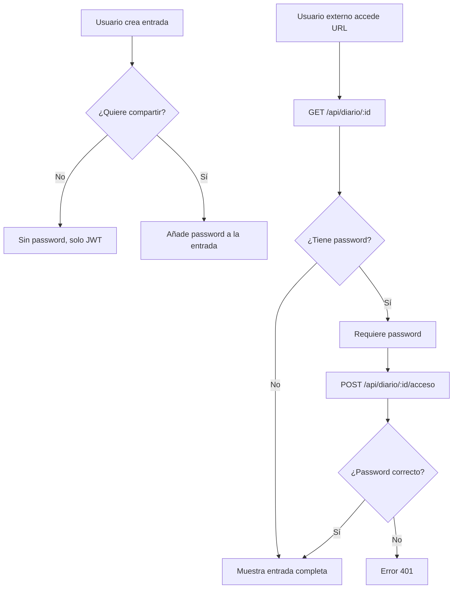

# Decisiones Técnicas - MindCare

**Fecha:** 13 de febrero de 2026  
**Proyecto:** MindCare - Aplicación de Salud Mental  
**Tipo de Documento:** Registro de Decisiones Arquitectónicas (ADR)

---

## 📋 Índice

- [1. Introducción](#1-introducción)
- [2. Decisiones Estratégicas](#2-decisiones-estratégicas)
- [3. Stack Tecnológico](#3-stack-tecnológico)
- [4. Decisiones de Seguridad](#4-decisiones-de-seguridad)
- [5. Decisiones de Base de Datos](#5-decisiones-de-base-de-datos)
- [6. Decisiones de Frontend](#6-decisiones-de-frontend)
- [7. Decisiones de Backend](#7-decisiones-de-backend)
- [8. Decisiones de Infraestructura](#8-decisiones-de-infraestructura)
- [9. Decisiones Descartadas](#9-decisiones-descartadas)

---

## 1. Introducción

Este documento registra las decisiones técnicas clave tomadas durante el desarrollo de MindCare. Cada decisión incluye el **contexto**, las **alternativas consideradas**, la **decisión final** y las **consecuencias**.

Formato basado en **Architecture Decision Records (ADR)**.

---

## 2. Decisiones Estratégicas

### ADR-001: Arquitectura MERN Stack

**Estado:** ✅ Aceptada

**Contexto:**
- Equipo con experiencia en JavaScript
- Necesidad de desarrollo rápido (6 semanas)
- Aplicación web interactiva con estado complejo
- Datos no relacionales (esquemas flexibles para salud mental)

**Alternativas consideradas:**

| Stack | Pros | Contras | Decisión |
|-------|------|---------|----------|
| **MERN (MongoDB, Express, React, Node)** | Único lenguaje (JS), ecosistema maduro, desarrollo rápido | MongoDB requiere diseño cuidadoso | ✅ **Elegido** |
| **LAMP (Linux, Apache, MySQL, PHP)** | Maduro, estable, hosting barato | PHP menos moderno, MySQL rígido para nuestros datos | ❌ |
| **Django + React + PostgreSQL** | Python excelente, Django admin útil | Equipo sin experiencia en Python | ❌ |
| **.NET Core + React + SQL Server** | Enterprise-grade, tipado fuerte | Curva de aprendizaje, menos ecosistema open-source | ❌ |

**Decisión:**
MERN Stack completo con JavaScript/Node.js en todo el proyecto.

**Consecuencias:**

✅ **Positivas:**
- Un único lenguaje reduce la carga cognitiva
- NPM ecosystem con millones de paquetes
- JSON nativo en toda la aplicación
- Desarrollo full-stack con un solo equipo

⚠️ **Negativas:**
- JavaScript no tipado (mitigado con JSDoc)
- MongoDB requiere más disciplina en diseño
- Necesidad de herramientas adicionales para type safety

**Fecha:** 2025-12-15

---

### ADR-002: Arquitectura Desacoplada (Frontend separado del Backend)

**Estado:** ✅ Aceptada

**Contexto:**
- Necesidad de escalar frontend y backend independientemente
- Posibilidad futura de app móvil usando la misma API
- Facilitar el trabajo en paralelo de equipos

**Alternativas:**

1. **Monolito (SSR con Pug/EJS)**: Renderizado en servidor
   - Pros: Más simple, mejor SEO inicial
   - Contras: Acoplamiento, menos interactividad, difícil escalar

2. **Arquitectura desacoplada (SPA + API REST)**: ✅ Elegido
   - Pros: Independencia, mejor UX, reutilizable para móvil
   - Contras: Requiere CORS, gestión de estado compleja

**Decisión:**
Frontend React SPA completamente separado del backend Express.

**Arquitectura:**

```
Cliente (Navegador)
      ↓ HTTPS/REST
Frontend (React) - Puerto 3000
      ↓ HTTPS/REST API
Backend (Express) - Puerto 4000
      ↓ MongoDB Protocol
MongoDB Atlas
```

**Consecuencias:**

✅ **Positivas:**
- Frontend y backend desplegables independientemente
- API reutilizable para futuras aplicaciones móviles
- Mejor separación de responsabilidades
- Equipos pueden trabajar en paralelo

⚠️ **Negativas:**
- Configuración CORS necesaria
- Dos deploys separados
- Gestión de estado más compleja en frontend

**Fecha:** 2025-12-20

---

## 3. Stack Tecnológico

### ADR-003: React como Framework de Frontend

**Estado:** ✅ Aceptada

**Contexto:**
- Necesidad de UI interactiva y dinámica
- Formularios complejos (registro de emociones)
- Estado global (autenticación, datos de usuario)

**Alternativas:**

| Framework | Pros | Contras | Decisión |
|-----------|------|---------|----------|
| **React** | Ecosistema enorme, Virtual DOM, Hooks, familiar | No opinionado, más configuración | ✅ **Elegido** |
| **Vue.js** | Más fácil de aprender, mejor documentación | Ecosistema más pequeño | ❌ |
| **Angular** | Framework completo, TypeScript nativo | Curva de aprendizaje empinada, muy pesado | ❌ |
| **Svelte** | Mejor rendimiento, menos boilerplate | Ecosistema inmaduro, equipo sin experiencia | ❌ |

**Decisión:**
React 18 con Hooks y componentes funcionales.

**Tecnologías complementarias:**
- **React Router v6**: Navegación declarativa
- **Zustand**: Estado global (ver ADR-004)
- **Axios**: Cliente HTTP
- **React Hot Toast**: Notificaciones

**Consecuencias:**

✅ **Positivas:**
- Componentes reutilizables (Atomic Design)
- React Hooks simplifican lógica de estado
- Enorme cantidad de librerías disponibles
- Excelente herramientas de desarrollo (React DevTools)

⚠️ **Negativas:**
- Necesidad de librerías externas para routing, estado, forms
- Decisiones de arquitectura recaen en el equipo
- Curva de aprendizaje para conceptos avanzados (useEffect, useMemo)

**Fecha:** 2025-12-18

---

### ADR-004: Zustand para Estado Global

**Estado:** ✅ Aceptada

**Contexto:**
- Necesidad de compartir estado de autenticación entre componentes
- Evitar prop drilling en componentes profundamente anidados
- Simplicidad vs features

**Alternativas:**

| Solución | Pros | Contras | Decisión |
|----------|------|---------|----------|
| **Zustand** | Minimalista (2.9kb), API simple, excelente performance | Menos funciones que Redux | ✅ **Elegido** |
| **Redux Toolkit** | Estándar de la industria, DevTools potentes | Mucho boilerplate, curva de aprendizaje | ❌ |
| **Context API** | Nativo de React, sin dependencias | Re-renders frecuentes, no optimizado | ❌ |
| **Jotai / Recoil** | Atomic state, moderno | Menos maduro, documentación limitada | ❌ |

**Decisión:**
Zustand con persistencia en localStorage.

**Implementación:**

```javascript
// store/authStore.js
import create from 'zustand';
import { persist } from 'zustand/middleware';

export const useAuthStore = create(
  persist(
    (set) => ({
      user: null,
      token: null,
      login: (user, token) => set({ user, token }),
      logout: () => set({ user: null, token: null }),
    }),
    {
      name: 'auth-storage',
      getStorage: () => localStorage,
    }
  )
);
```

**Consecuencias:**

✅ **Positivas:**
- Código más limpio (60% menos líneas vs Redux)
- Sin boilerplate (actions, reducers, dispatchers)
- Persistencia integrada
- Mejor performance (menos re-renders)
- Fácil de aprender para el equipo

⚠️ **Negativas:**
- Menos herramientas de debugging que Redux DevTools
- Sin time-travel debugging
- Menos recursos educativos

**Fecha:** 2026-01-05

---

### ADR-005: MongoDB como Base de Datos

**Estado:** ✅ Aceptada

**Contexto:**
- Datos de salud mental con estructuras variables
- Emociones, síntomas y factores detonantes no estandarizados
- Necesidad de flexibilidad en el esquema

**Alternativas:**

| Base de Datos | Pros | Contras | Decisión |
|---------------|------|---------|----------|
| **MongoDB** | Flexible, JSON nativo, agregaciones potentes, Atlas gratis | Requiere disciplina en diseño | ✅ **Elegido** |
| **PostgreSQL** | ACID completo, relaciones fuertes, JSON support | Esquema rígido, más complejo para datos variables | ❌ |
| **MySQL** | Maduro, estable, ampliamente soportado | Esquema rígido, no ideal para datos semi-estructurados | ❌ |
| **Firebase** | Backend as a Service, tiempo real | Vendor lock-in, menos control, pricing impredecible | ❌ |

**Decisión:**
MongoDB Atlas (cloud) con Mongoose ODM.

**Diseño de esquemas:**

```javascript
// Ejemplo: Registro con subdocumentos embebidos
{
  usuarioId: ObjectId,
  fechaCreacion: Date,
  estadoAnimo: {
    emociones: [{ nombre: String, intensidad: Number }], // Embebido
    comentario: String
  },
  sueno: { /* subdocumento */ },
  actividadFisica: [{ /* array de subdocumentos */ }]
}
```

**Estrategia de normalización:**
- **Embedding**: Datos one-to-few (emociones dentro de registros)
- **Referencing**: Datos one-to-many (usuario → registros)

**Consecuencias:**

✅ **Positivas:**
- Esquemas flexibles para evolución del producto
- JSON nativo (compatible con JavaScript)
- MongoDB Atlas: 512MB gratis, backups automáticos
- Agregaciones potentes para estadísticas
- Escalabilidad horizontal nativa (sharding)

⚠️ **Negativas:**
- No ACID en múltiples documentos (mitigado con transacciones en MongoDB 4+)
- Requiere más disciplina en diseño (no hay foreign keys automáticas)
- Potencial de denormalización excesiva

**Fecha:** 2025-12-22

---

## 4. Decisiones de Seguridad

### ADR-006: JWT para Autenticación

**Estado:** ✅ Aceptada

**Contexto:**
- Arquitectura stateless (sin sesiones en servidor)
- Backend y frontend en dominios separados
- Necesidad de autenticación escalable

**Alternativas:**

| Método | Pros | Contras | Decisión |
|--------|------|---------|----------|
| **JWT (JSON Web Tokens)** | Stateless, escalable, estándar de la industria | No se puede revocar fácilmente | ✅ **Elegido** |
| **Sesiones con Cookies** | Fácil revocación, más seguro contra XSS | Requiere estado en servidor, no escalable | ❌ |
| **OAuth 2.0 (Google, Facebook)** | Sin gestión de contraseñas, UX familiar | Dependencia de terceros, menos control | ❌ Futuro |
| **Session Tokens + Redis** | Revocación inmediata, seguro | Requiere Redis, más complejo | ❌ |

**Decisión:**
JWT con algoritmo HS256 y expiración de 7 días.

**Implementación:**

```javascript
// Generación del token
const jwt = require('jsonwebtoken');

const token = jwt.sign(
  { 
    id: user._id, 
    email: user.email,
    nombre: user.nombre
  },
  process.env.JWT_SECRET,
  { expiresIn: process.env.JWT_EXPIRES_IN || '7d' }
);

// Verificación del token
const authMiddleware = (req, res, next) => {
  const token = req.header('Authorization')?.replace('Bearer ', '');
  const decoded = jwt.verify(token, process.env.JWT_SECRET);
  req.user = decoded;
  next();
};
```

**Seguridad implementada:**
- ✅ Secret de 64 caracteres (256 bits)
- ✅ Expiración configurable
- ✅ Almacenado en `localStorage` (alternativa: `httpOnly` cookies)
- ✅ Verificación en cada request protegido
- ✅ Validación de estructura del token

**Consecuencias:**

✅ **Positivas:**
- Stateless: backend no mantiene sesiones
- Escalable horizontalmente
- CORS-friendly (no requiere cookies cross-domain)
- Portabilidad (futuras apps móviles)

⚠️ **Negativas:**
- No se puede revocar sin blacklist (mitigado con expiración corta)
- Vulnerable a XSS si se almacena en localStorage
- Payload visible (usar HTTPS obligatorio)

**Mitigación de riesgos:**
- HTTPS obligatorio en producción
- Helmet.js para headers de seguridad
- Sanitización de inputs
- Expiración de tokens
- (Futuro) Refresh tokens con rotación

**Fecha:** 2025-12-28

---

### ADR-007: bcrypt para Hashing de Contraseñas

**Estado:** ✅ Aceptada

**Contexto:**
- Necesidad de almacenar contraseñas de forma segura
- Protección contra rainbow tables y brute force
- Estándar de la industria

**Alternativas:**

| Algoritmo | Pros | Contras | Decisión |
|-----------|------|---------|----------|
| **bcrypt** | Estándar de la industria, adaptativo (cost factor) | Más lento que otros | ✅ **Elegido** |
| **Argon2** | Ganador PHC 2015, resistente a GPUs | Menos maduro, menos librerías | ❌ |
| **PBKDF2** | Estándar NIST, ampliamente soportado | Menos resistente a GPUs | ❌ |
| **SHA-256 (simple)** | Rápido | INSEGURO (no salt, rainbow tables) | ❌ |

**Decisión:**
bcrypt con 10 rounds (2^10 iteraciones).

**Implementación:**

```javascript
const bcrypt = require('bcryptjs');

// Pre-save hook en Mongoose
usuarioSchema.pre('save', async function (next) {
  if (!this.isModified('password')) return next();
  
  const salt = await bcrypt.genSalt(10); // 10 rounds
  this.password = await bcrypt.hash(this.password, salt);
  next();
});

// Método de comparación
usuarioSchema.methods.compararPassword = async function (candidatePassword) {
  return bcrypt.compare(candidatePassword, this.password);
};
```

**Consecuencias:**

✅ **Positivas:**
- Resistente a rainbow tables (salt único por password)
- Resistente a brute force (cost factor adaptativo)
- Estándar en Node.js (bcryptjs sin dependencias nativas)

⚠️ **Negativas:**
- Más lento que otros algoritmos (intencional)
- ~300ms por hash (aceptable para login)

**Fecha:** 2025-12-20

---

### ADR-008: Diario con Doble Capa de Seguridad

**Estado:** ✅ Aceptada - Innovación única

**Contexto:**
- Necesidad de compartir entradas de diario de forma segura
- Usuarios quieren control granular sobre privacidad
- No exponer todas las entradas públicamente

**Diseño:**
1. **Primera capa**: Autenticación JWT (solo el usuario ve sus entradas)
2. **Segunda capa**: Password opcional por entrada (para compartir)

**Flujo:**



**Implementación:**

```javascript
// Modelo con password opcional
const diarioSchema = new Schema({
  usuarioId: { type: ObjectId, ref: 'User' },
  titulo: String,
  cuerpo: String,
  password: String, // ← Opcional, hasheado con bcrypt
}, { timestamps: true });

// Endpoint público con password
router.post('/:id/acceso', async (req, res) => {
  const entrada = await Diario.findById(req.params.id);
  const isValid = await entrada.compararPassword(req.body.password);
  
  if (!isValid) return res.status(401).json({ message: 'Contraseña incorrecta' });
  
  res.json({ titulo: entrada.titulo, cuerpo: entrada.cuerpo });
});
```

**Consecuencias:**

✅ **Positivas:**
- Control granular de privacidad por entrada
- Permite compartir selectivamente con terapeutas, amigos
- URL pública pero contenido protegido
- Sin necesidad de crear cuentas para lectores

⚠️ **Negativas:**
- Mayor complejidad en el modelo
- Password adicional para recordar
- Riesgo de olvido de contraseña (sin recuperación implementada)

**Caso de uso:**
> Usuario escribe entrada personal y quiere compartirla solo con su terapeuta mediante un enlace y password.

**Fecha:** 2026-01-10

---

## 5. Decisiones de Base de Datos

### ADR-009: Mongoose como ODM

**Estado:** ✅ Aceptada

**Contexto:**
- MongoDB driver nativo es de bajo nivel
- Necesidad de validaciones de esquema
- Middleware para transformaciones (ej: hashear passwords)

**Alternativas:**

| ODM/Driver | Pros | Contras | Decisión |
|------------|------|---------|----------|
| **Mongoose** | Validaciones, middleware, popular | Overhead adicional, más lento | ✅ **Elegido** |
| **MongoDB Native Driver** | Máxima performance, sin abstracción | Sin validaciones, mucho código boilerplate | ❌ |
| **Prisma** | Type-safe, excelente DX | No diseñado para MongoDB | ❌ |

**Decisión:**
Mongoose 8.x con schemas estrictos.

**Beneficios obtenidos:**

```javascript
// Validaciones declarativas
const usuarioSchema = new Schema({
  email: {
    type: String,
    required: [true, 'El email es obligatorio'],
    unique: true,
    match: [/\S+@\S+\.\S+/, 'Email no válido']
  },
  password: {
    type: String,
    minlength: [8, 'Contraseña debe tener al menos 8 caracteres']
  }
});

// Middleware pre-save
usuarioSchema.pre('save', async function() {
  // Hash password automáticamente
});

// Métodos de instancia
usuarioSchema.methods.compararPassword = function(candidate) {
  return bcrypt.compare(candidate, this.password);
};
```

**Consecuencias:**

✅ **Positivas:**
- Validaciones centralizadas
- Código más limpio y legible
- Middleware potente (pre/post hooks)
- Métodos de instancia personalizados
- Populación de referencias automática

⚠️ **Negativas:**
- ~10-15% overhead vs driver nativo
- Curva de aprendizaje de Mongoose

**Fecha:** 2025-12-22

---

### ADR-010: Estrategia de Embedding vs Referencing

**Estado:** ✅ Aceptada

**Contexto:**
- MongoDB permite tanto embedding (subdocumentos) como referencing
- Decisión afecta rendimiento y consistencia

**Estrategia adoptada:**

| Relación | Estrategia | Justificación |
|----------|------------|---------------|
| Usuario → Registros | **Referencing** | One-to-many, registros crecen indefinidamente |
| Usuario → Formulario | **Referencing** | One-to-one, pero separado por organización |
| Registro → Emociones | **Embedding** | One-to-few, siempre se consultan juntos |
| Registro → Cognición | **Embedding** | One-to-few, parte integral del registro |

**Reglas de decisión:**

```
Embedding si:
- Relación one-to-few (< 100 subdocumentos)
- Datos siempre consultados juntos
- Subdocumentos no necesitan existencia independiente

Referencing si:
- Relación one-to-many (cientos o miles)
- Datos consultados independientemente
- Necesidad de actualizar documentos por separado
```

**Ejemplo práctico:**

```javascript
// ✅ EMBEDDING: Emociones dentro de Registro
{
  _id: ObjectId("..."),
  usuarioId: ObjectId("..."),
  estadoAnimo: {
    emociones: [
      { nombre: "Ansiedad", intensidad: 4 },  // Embebido
      { nombre: "Feliz", intensidad: 3 }
    ]
  }
}

// ✅ REFERENCING: Registros separados de Usuario
{
  _id: ObjectId("user123"),
  nombre: "María",
  email: "maria@ejemplo.com"
}

{
  _id: ObjectId("registro1"),
  usuarioId: ObjectId("user123"),  // Referencia
  fechaCreacion: Date("2026-02-13")
}
```

**Consecuencias:**

✅ **Positivas:**
- Consultas optimizadas (menos JOINs)
- Balance entre denormalización y consistencia

⚠️ **Negativas:**
- Requiere disciplina en diseño
- Potencial duplicación de datos si se abusa de embedding

**Fecha:** 2026-01-03

---

## 6. Decisiones de Frontend

### ADR-011: Atomic Design para Componentes

**Estado:** ✅ Aceptada

**Contexto:**
- Necesidad de componentes reutilizables
- Evitar duplicación de código
- Facilitar testing de componentes aislados

**Metodología:** Atomic Design de Brad Frost

```
src/components/
├── atoms/       → Elementos básicos (Button, Input, Label)
├── molecules/   → Combinaciones simples (FormField = Label + Input)
├── organisms/   → Componentes complejos (Navbar, Form completo)
└── layout/      → Layouts de página (MainLayout, AuthLayout)
```

**Ejemplos:**

```javascript
// Atom: components/atoms/Button.jsx
export const Button = ({ children, variant, onClick }) => (
  <button className={`btn btn-${variant}`} onClick={onClick}>
    {children}
  </button>
);

// Molecule: components/molecules/FormField.jsx
export const FormField = ({ label, type, value, onChange }) => (
  <div className="form-field">
    <Label>{label}</Label>
    <Input type={type} value={value} onChange={onChange} />
  </div>
);

// Organism: components/organisms/LoginForm.jsx
export const LoginForm = () => {
  const [email, setEmail] = useState('');
  const [password, setPassword] = useState('');
  
  return (
    <form>
      <FormField label="Email" value={email} onChange={setEmail} />
      <FormField label="Password" type="password" value={password} onChange={setPassword} />
      <Button variant="primary">Iniciar Sesión</Button>
    </form>
  );
};
```

**Consecuencias:**

✅ **Positivas:**
- Reutilización de componentes
- Facilita testing unitario
- Diseño consistente
- Escalabilidad de UI

⚠️ **Negativas:**
- Requiere planificación inicial
- Más archivos en el proyecto

**Fecha:** 2026-01-08

---

### ADR-012: React Router v6 para Navegación

**Estado:** ✅ Aceptada

**Contexto:**
- Aplicación multi-página (SPA con routing)
- Necesidad de rutas protegidas (autenticación)
- URLs limpias y bookmarkeables

**Decisión:**
React Router DOM v6 con `BrowserRouter`.

**Características usadas:**

```javascript
// App.js
<BrowserRouter>
  <Routes>
    {/* Rutas públicas */}
    <Route path="/" element={<Landing />} />
    <Route path="/login" element={<Login />} />
    
    {/* Rutas protegidas */}
    <Route path="/home" element={
      <ProtectedRoute>
        <Home />
      </ProtectedRoute>
    } />
    
    {/* Redirect */}
    <Route path="*" element={<Navigate to="/" />} />
  </Routes>
</BrowserRouter>

// ProtectedRoute wrapper
const ProtectedRoute = ({ children }) => {
  const { user, token } = useAuthStore();
  
  if (!user || !token) {
    return <Navigate to="/login" replace />;
  }
  
  return children;
};
```

**Consecuencias:**

✅ **Positivas:**
- Navegación declarativa
- Rutas anidadas
- Protección de rutas elegante
- URLs bookmarkeables

⚠️ **Negativas:**
- Cambio de API desde v5 (curva de aprendizaje)

**Fecha:** 2026-01-05

---

## 7. Decisiones de Backend

### ADR-013: Arquitectura MVC

**Estado:** ✅ Aceptada

**Contexto:**
- Necesidad de organización escalable del código backend
- Separación de responsabilidades
- Facilitar testing

**Estructura adoptada:**

```
src/
├── models/        → Mongoose schemas (Datos)
├── controllers/   → Lógica de negocio (Controladores)
├── routes/        → Definición de endpoints (Rutas)
├── middleware/    → Middleware (autenticación, validación)
└── services/      → Servicios externos (IA, email)
```

**Flujo de una request:**

```
Request → Route → Middleware → Controller → Service → Model → DB
                     ↓              ↓           ↓        ↓
                 Auth Check    Business    External   Data
                               Logic       APIs      Access
```

**Ejemplo práctico:**

```javascript
// routes/registro.routes.js
router.post('/', authMiddleware, registroController.createRegistro);

// controllers/registro.controller.js
exports.createRegistro = async (req, res) => {
  try {
    const registro = await Registro.create({
      usuarioId: req.user.id, // Del middleware
      ...req.body
    });
    res.status(201).json({ message: 'Registro creado', registro });
  } catch (error) {
    res.status(500).json({ message: error.message });
  }
};

// models/registro_mongoose.js
const registroSchema = new Schema({ /* ... */ });
module.exports = mongoose.model('Registro', registroSchema);
```

**Consecuencias:**

✅ **Positivas:**
- Código organizado y predecible
- Fácil localizar dónde hacer cambios
- Testing de capas independiente
- Nuevos desarrolladores entienden rápido

⚠️ **Negativas:**
- Más archivos y carpetas
- Overhead inicial de configuración

**Fecha:** 2025-12-28

---

### ADR-014: Middleware Chain para Seguridad

**Estado:** ✅ Aceptada

**Contexto:**
- Necesidad de aplicar múltiples capas de seguridad
- Validación de autenticación en rutas protegidas
- Headers de seguridad HTTP

**Middleware aplicados:**

```javascript
// app.js
app.use(helmet());        // Headers de seguridad HTTP
app.use(cors(corsOptions)); // Control de acceso cross-origin
app.use(express.json());  // Parse JSON
app.use(cookieParser());  // Parse cookies
app.use(morgan('dev'));   // Logging HTTP

// En rutas específicas
router.post('/', authMiddleware, registroController.create);
                  ↑ Middleware de autenticación
```

**Helmet headers aplicados:**

```
X-DNS-Prefetch-Control: off
X-Frame-Options: SAMEORIGIN
X-Content-Type-Options: nosniff
X-XSS-Protection: 0
```

**CORS configurado:**

```javascript
const corsOptions = {
  origin: process.env.FRONTEND_URL || 'http://localhost:3000',
  credentials: true,
  optionsSuccessStatus: 200
};
```

**Consecuencias:**

✅ **Positivas:**
- Seguridad en capas (defense in depth)
- Configuración centralizada
- Fácil añadir/quitar middleware

⚠️ **Negativas:**
- Orden de middleware importa
- Debugging más complejo

**Fecha:** 2026-01-02

---

## 8. Decisiones de Infraestructura

### ADR-015: Docker para Contenedorización

**Estado:** ✅ Aceptada

**Contexto:**
- Necesidad de entornos consistentes
- Facilitar onboarding de nuevos desarrolladores
- Despliegue reproducible

**Alternativas:**

| Opción | Pros | Contras | Decisión |
|--------|------|---------|----------|
| **Docker** | Portabilidad, aislamiento, estándar de la industria | Curva de aprendizaje | ✅ **Elegido** |
| **Instalación local** | Sin overhead, más simple | Inconsistencias entre entornos | ❌ |
| **Vagrant** | VMs completas | Muy pesado, lento | ❌ |

**Decisión:**
Docker + Docker Compose para orquestación local.

**docker-compose.yml:**

```yaml
services:
  backend:
    build: ./backend
    ports:
      - "4000:4000"
    environment:
      - MONGODB_URI=${MONGODB_URI}
      - JWT_SECRET=${JWT_SECRET}
    healthcheck:
      test: ["CMD", "wget", "--spider", "http://localhost:4000/api/health"]
      interval: 30s
  
  frontend:
    build: ./frontend
    ports:
      - "3000:80"
    depends_on:
      backend:
        condition: service_healthy
```

**Comandos simplificados:**

```bash
# Levantar todo
docker-compose up -d

# Ver logs
docker-compose logs -f

# Parar todo
docker-compose down
```

**Consecuencias:**

✅ **Positivas:**
- Entorno idéntico en desarrollo y producción
- Onboarding: `git clone` → `docker-compose up` → listo
- Aislamiento de dependencias
- Fácil rollback a versiones anteriores

⚠️ **Negativas:**
- Requiere aprender Docker
- Overhead de performance en desarrollo (mitigado con bind mounts)
- Archivos Docker adicionales

**Fecha:** 2026-01-20

---

### ADR-016: GitHub Actions para CI/CD

**Estado:** ✅ Aceptada

**Contexto:**
- Necesidad de automatizar testing y despliegue
- Integración con GitHub (donde está el código)
- CI/CD gratuito para proyectos públicos

**Alternativas:**

| Servicio | Pros | Contras | Decisión |
|----------|------|---------|----------|
| **GitHub Actions** | Gratis, integrado con GitHub, flexible | Sintaxis YAML compleja | ✅ **Elegido** |
| **GitLab CI** | Excelente CI/CD | Requiere migrar a GitLab | ❌ |
| **Jenkins** | Muy potente, self-hosted | Requiere servidor, mucho setup | ❌ |
| **CircleCI** | Fácil de configurar | Límite de minutos en plan gratuito | ❌ |

**Decisión:**
GitHub Actions con workflows para build, test y deploy.

**Workflow de ejemplo:**

```yaml
# .github/workflows/docker-build.yml
name: Build and Push Docker Images

on:
  push:
    branches: [main]

jobs:
  build-backend:
    runs-on: ubuntu-latest
    steps:
      - uses: actions/checkout@v3
      
      - name: Build Docker image
        run: docker build -t mindcare-backend ./backend
      
      - name: Push to Docker Hub
        run: |
          echo ${{ secrets.DOCKER_PASSWORD }} | docker login -u ${{ secrets.DOCKER_USERNAME }} --password-stdin
          docker push mindcare-backend:latest
```

**Workflows implementados:**
- ✅ **Build**: Construir imágenes Docker
- ✅ **Test**: Ejecutar tests (futuro)
- ✅ **Deploy**: Desplegar a Render automáticamente

**Consecuencias:**

✅ **Positivas:**
- Automatización completa de despliegues
- Detección temprana de errores
- Historial de builds
- Badges de estado en README

⚠️ **Negativas:**
- Sintaxis YAML puede ser compleja
- Debugging de workflows no trivial

**Fecha:** 2026-01-25

---

### ADR-017: Render para Hosting de Producción

**Estado:** ✅ Aceptada

**Contexto:**
- Necesidad de hosting gratuito para MVP
- Soporte para Docker
- HTTPS automático

**Alternativas:**

| Plataforma | Pros | Contras | Decisión |
|------------|------|---------|----------|
| **Render** | Tier gratuito, Docker native, HTTPS auto | Cold starts | ✅ **Elegido** |
| **Heroku** | Muy fácil, maduro | Eliminó tier gratuito en 2022 | ❌ |
| **Railway** | Excelente DX, logs potentes | $5/mes mínimo | ❌ |
| **AWS EC2** | Control total, escalable | Complejo, requiere DevOps | ❌ |
| **Vercel** | Perfecto para frontend | No ideal para backend pesado | ❌ Solo frontend |

**Decisión:**
Render para backend y frontend, MongoDB Atlas para BD.

**Configuración:**

```yaml
# render.yaml
services:
  - type: web
    name: mindcare-backend
    env: docker
    dockerfilePath: ./backend/Dockerfile
    envVars:
      - key: MONGODB_URI
        sync: false  # Secret
      - key: JWT_SECRET
        sync: false
  
  - type: web
    name: mindcare-frontend
    env: static
    buildCommand: npm run build
    staticPublishPath: ./build
```

**Consecuencias:**

✅ **Positivas:**
- Tier gratuito 750h/mes
- HTTPS automático con Let's Encrypt
- Deploy desde Docker Hub o Git
- URLs públicas accesibles
- Logs centralizados

⚠️ **Negativas:**
- Cold starts después de 15min inactividad (tier gratuito)
- Límite de ancho de banda en tier gratuito
- Menos control que VPS propio

**Fecha:** 2026-01-28

---

## 9. Decisiones Descartadas

### Decisiones que NO se implementaron (y por qué)

#### ❌ TypeScript

**Razón:**
- Equipo sin experiencia previa
- Tiempo limitado (6 semanas)
- Complejidad adicional de configuración

**Alternativa adoptada:**
- JSDoc para documentación de tipos
- ESLint para detección de errores

**Futura reconsideración:** Sí, cuando el equipo tenga más experiencia

---

#### ❌ Redux para Estado Global

**Razón:**
- Mucho boilerplate para un proyecto pequeño
- Curva de aprendizaje empinada
- Zustand cumple con los requisitos

**Alternativa adoptada:** Zustand

---

#### ❌ GraphQL en lugar de REST

**Razón:**
- Complejidad adicional
- REST es suficiente para nuestra escala
- Equipo más familiarizado con REST

**Alternativa adoptada:** API RESTful

---

#### ❌ Testing Automatizado (inicialmente)

**Razón:**
- Prioridad en funcionalidades del MVP
- Testing manual suficiente para Sprint 1-2

**Estado:** Planeado para Sprint 3-4

---

#### ❌ WebSockets para Notificaciones en Tiempo Real

**Razón:**
- No es crítico para el MVP
- Polling es suficiente inicialmente
- Mayor complejidad de infraestructura

**Estado:** Considerado para versión 2.0

---

#### ❌ Microservicios

**Razón:**
- Overkill para nuestra escala
- Monolito modular es más simple
- Equipo pequeño

**Alternativa adoptada:** Monolito bien estructurado con MVC

---

## Resumen de Tecnologías Adoptadas

```
Frontend:
  ✅ React 18
  ✅ Zustand
  ✅ React Router v6
  ✅ Axios
  ✅ React Hot Toast

Backend:
  ✅ Node.js + Express
  ✅ MongoDB + Mongoose
  ✅ JWT (jsonwebtoken)
  ✅ bcryptjs
  ✅ Helmet + CORS

Infraestructura:
  ✅ Docker + Docker Compose
  ✅ GitHub Actions
  ✅ Render
  ✅ MongoDB Atlas

Herramientas:
  ✅ Git + GitHub
  ✅ Postman (testing API)
  ✅ JSDoc (documentación)
```

---

**Documento mantenido por:** Equipo MindCare  
**Última actualización:** 13 de febrero de 2026  
**Próxima revisión:** Fin de Sprint 4
