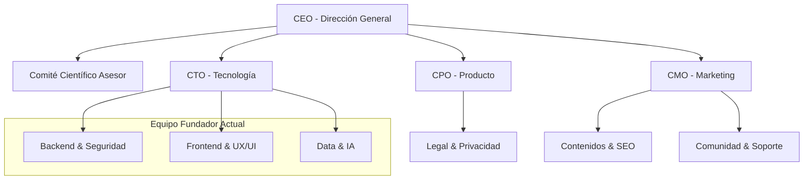

# 🏢 Fase 1b: Estructura Organizativa de la Empresa

**Empresa Ficticia:** MindTracker Solutions S.L.
**Sector:** HealthTech / Bienestar Digital
**Tipo de Empresa:** Startup SaaS (Software as a Service) B2C.

## 1. Definición de la Estructura

Para una empresa tecnológica enfocada en salud mental, proponemos una **Estructura Funcional Horizontal**.
* **Justificación:** Al ser un producto digital, la agilidad es clave. Una estructura plana fomenta la comunicación rápida entre Desarrollo y Producto.
* **Escalabilidad:** Se divide en células de trabajo (Squads) a medida que el producto crece.

## 2. Departamentos y Funciones Clave

### A. Dirección Ejecutiva (C-Level)
* **CEO (Chief Executive Officer):** Visión global, búsqueda de financiación y alianzas estratégicas (ONGs, Sanidad).
* **Comité Ético y Científico (Externo):** *CRÍTICO EN ESTE SECTOR.* Psicólogos consultores que validan que los artículos y consejos de la app tienen rigor clínico.

### B. Tecnología y Producto (El núcleo del equipo actual)
* **CTO (Chief Technology Officer):** Define la arquitectura (MERN), seguridad de datos (LOPD) y liderazgo técnico.
* **Product Manager:** Prioriza el backlog (qué funcionalidades se hacen primero según el feedback de usuarios).
* **Equipo de Desarrollo:**
    * *Frontend:* React, UX/UI, Accesibilidad.
    * *Backend:* Node.js, Express, Seguridad API, Base de Datos.
    * *DevOps/QA:* Despliegues en Render/Vercel y pruebas automáticas.

### C. Marketing y Crecimiento (Growth)
* **CMO (Chief Marketing Officer):** Estrategia de captación de usuarios (RRSS, SEO de contenidos de salud).
* **Content Manager:** Redacción de los artículos de la sección educativa (debe trabajar con el comité científico).

### D. Legal y Cumplimiento
* **DPO (Data Protection Officer):** Dado que tratamos datos de salud (nivel alto de protección según RGPD), esta figura es obligatoria para auditar la seguridad de la información.

## 3. Organigrama Visual (Mermaid)

## 4. Justificación de la Estructura

### A. ¿Por qué hemos elegido esta estructura?
Hemos optado por una **Estructura Funcional Horizontal (Flat Structure)** por tres motivos estratégicos alineados con el sector *HealthTech*:

1.  **Agilidad en la Toma de Decisiones:** En el desarrollo de un MVP de salud mental, la comunicación entre el responsable de producto (que define *qué* ayuda al paciente) y el equipo técnico (que define *cómo* se implementa de forma segura) debe ser directa. Eliminar jerarquías intermedias evita el "teléfono roto".
2.  **Seguridad y Ética desde el Diseño:** Al ser una estructura pequeña y horizontal, el **CTO** y el **Comité Científico** pueden supervisar directamente cada funcionalidad nueva, asegurando que cumple con la LOPD y criterios clínicos antes de escribir una sola línea de código.
3.  **Eficiencia de Costes:** En una fase inicial (Seed Stage), los recursos son limitados. Una estructura matricial o jerárquica implicaría costes de gestión (managers) que no aportan valor directo al producto.

### B. Tamaño del Equipo Inicial (Fase de Lanzamiento)
Para lanzar el MVP al mercado y operarlo durante los primeros 6 meses, el equipo mínimo viable sería de **4-5 personas**:

* **3 Fundadores (Full-Stack & Gestión):**
    * *Perfil 1 (Adrián):* Backend, Seguridad y Cloud (DevOps).
    * *Perfil 2 (Rocío):* Frontend, UX/UI y Marketing digital.
    * *Perfil 3 (José):* Datos, IA y QA/Soporte.
* **1 Asesor Clínico (Part-time/Externo):** Un psicólogo colegiado que valide los contenidos y protocolos de emergencia. *No es necesario contratarlo a tiempo completo al inicio, pero es vital para la credibilidad.*
* **1 Asesor Legal/DPO (Outsourced):** Contratación externa de un servicio de consultoría para auditorías de protección de datos (RGPD).

### C. Estrategia de Escalado (Roadmap de Crecimiento)
La empresa evolucionará en tres fases según la captación de usuarios:

**Fase 1: Validación (Meses 0-12)**
* **Foco:** Supervivencia y ajuste del producto al mercado (Product-Market Fit).
* **Estructura:** Los fundadores hacen "de todo". El soporte al cliente lo atienden los propios desarrolladores para detectar bugs rápidamente.

**Fase 2: Profesionalización (Meses 12-24)**
* *Hito:* Se alcanza una base de usuarios recurrente o primera ronda de inversión.
* **Contrataciones Clave:**
    * **Customer Success Manager:** Para liberar a los desarrolladores de atender tickets de soporte.
    * **DPO In-house:** La privacidad se vuelve crítica y requiere supervisión diaria.
    * **Sales/Growth:** Si se lanza una versión B2B para clínicas o empresas.

**Fase 3: Expansión (Mes 24+)**
* *Hito:* Internacionalización o grandes volúmenes de datos.
* **Cambio Estructural:** Se pasa a una **Estructura Matricial por "Squads"** (Equipos multidisciplinares):
    * *Squad "Diario":* Enfocados solo en la experiencia de escritura y compartir.
    * *Squad "IA & Datos":* Enfocados en mejorar el algoritmo de recomendaciones.
    * *Squad "Clínico":* Enfocados en la relación con profesionales de la salud.
