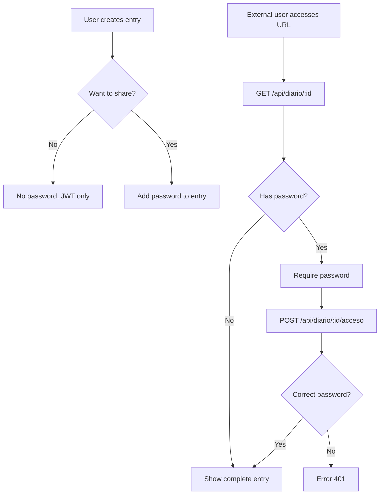

# Technical Decisions - MindCare

**Date:** February 13, 2026  
**Project:** MindCare - Mental Health Application  
**Document Type:** Architectural Decision Records (ADR)

---

## 📋 Table of Contents

- [1. Introduction](#1-introduction)
- [2. Strategic Decisions](#2-strategic-decisions)
- [3. Technology Stack](#3-technology-stack)
- [4. Security Decisions](#4-security-decisions)
- [5. Database Decisions](#5-database-decisions)
- [6. Frontend Decisions](#6-frontend-decisions)
- [7. Backend Decisions](#7-backend-decisions)
- [8. Infrastructure Decisions](#8-infrastructure-decisions)
- [9. Rejected Decisions](#9-rejected-decisions)

---

## 1. Introduction

This document records the key technical decisions made during the development of MindCare. Each decision includes the **context**, **alternatives considered**, **final decision**, and **consequences**.

Format based on **Architecture Decision Records (ADR)**.

---

## 2. Strategic Decisions

### ADR-001: MERN Stack Architecture

**Status:** ✅ Accepted

**Context:**
- Team with JavaScript experience
- Need for rapid development (6 weeks)
- Interactive web application with complex state
- Non-relational data (flexible schemas for mental health)

**Alternatives considered:**

| Stack | Pros | Cons | Decision |
|-------|------|------|----------|
| **MERN (MongoDB, Express, React, Node)** | Single language (JS), mature ecosystem, rapid development | MongoDB requires careful design | ✅ **Chosen** |
| **LAMP (Linux, Apache, MySQL, PHP)** | Mature, stable, cheap hosting | PHP less modern, MySQL rigid for our data | ❌ |
| **Django + React + PostgreSQL** | Excellent Python, useful Django admin | No team experience in Python | ❌ |
| **.NET Core + React + SQL Server** | Enterprise-grade, strong typing | Learning curve, less open-source ecosystem | ❌ |

**Decision:**
Complete MERN Stack with JavaScript/Node.js throughout the project.

**Consequences:**

✅ **Positive:**
- Single language reduces cognitive load
- NPM ecosystem with millions of packages
- Native JSON throughout the application
- Full-stack development with a single team

⚠️ **Negative:**
- Untyped JavaScript (mitigated with JSDoc)
- MongoDB requires more design discipline
- Need for additional tools for type safety

**Date:** 2025-12-15

---

### ADR-002: Decoupled Architecture (Frontend separated from Backend)

**Status:** ✅ Accepted

**Context:**
- Need to scale frontend and backend independently
- Future possibility of mobile app using the same API
- Facilitate parallel work of teams

**Alternatives:**

1. **Monolith (SSR with Pug/EJS)**: Server-side rendering
   - Pros: Simpler, better initial SEO
   - Cons: Coupling, less interactivity, difficult to scale

2. **Decoupled architecture (SPA + REST API)**: ✅ Chosen
   - Pros: Independence, better UX, reusable for mobile
   - Cons: Requires CORS, complex state management

**Decision:**
React SPA frontend completely separated from Express backend.

**Architecture:**

```
Client (Browser)
      ↓ HTTPS/REST
Frontend (React) - Port 3000
      ↓ HTTPS/REST API
Backend (Express) - Port 4000
      ↓ MongoDB Protocol
MongoDB Atlas
```

**Consequences:**

✅ **Positive:**
- Frontend and backend independently deployable
- API reusable for future mobile applications
- Better separation of concerns
- Teams can work in parallel

⚠️ **Negative:**
- CORS configuration necessary
- Two separate deployments
- More complex state management in frontend

**Date:** 2025-12-20

---

## 3. Technology Stack

### ADR-003: React as Frontend Framework

**Status:** ✅ Accepted

**Context:**
- Need for interactive and dynamic UI
- Complex forms (emotion recording)
- Global state (authentication, user data)

**Alternatives:**

| Framework | Pros | Cons | Decision |
|-----------|------|------|----------|
| **React** | Huge ecosystem, Virtual DOM, Hooks, familiar | Not opinionated, more configuration | ✅ **Chosen** |
| **Vue.js** | Easier to learn, better documentation | Smaller ecosystem | ❌ |
| **Angular** | Complete framework, native TypeScript | Steep learning curve, very heavy | ❌ |
| **Svelte** | Better performance, less boilerplate | Immature ecosystem, no team experience | ❌ |

**Decision:**
React 18 with Hooks and functional components.

**Complementary technologies:**
- **React Router v6**: Declarative navigation
- **Zustand**: Global state (see ADR-004)
- **Axios**: HTTP client
- **React Hot Toast**: Notifications

**Consequences:**

✅ **Positive:**
- Reusable components (Atomic Design)
- React Hooks simplify state logic
- Huge amount of available libraries
- Excellent development tools (React DevTools)

⚠️ **Negative:**
- Need for external libraries for routing, state, forms
- Architecture decisions fall on the team
- Learning curve for advanced concepts (useEffect, useMemo)

**Date:** 2025-12-18

---

### ADR-004: Zustand for Global State

**Status:** ✅ Accepted

**Context:**
- Need to share authentication state between components
- Avoid prop drilling in deeply nested components
- Simplicity vs features

**Alternatives:**

| Solution | Pros | Cons | Decision |
|----------|------|------|----------|
| **Zustand** | Minimalist (2.9kb), simple API, excellent performance | Fewer features than Redux | ✅ **Chosen** |
| **Redux Toolkit** | Industry standard, powerful DevTools | Much boilerplate, learning curve | ❌ |
| **Context API** | Native to React, no dependencies | Frequent re-renders, not optimized | ❌ |
| **Jotai / Recoil** | Atomic state, modern | Less mature, limited documentation | ❌ |

**Decision:**
Zustand with persistence in localStorage.

**Implementation:**

```javascript
// store/authStore.js
import create from 'zustand';
import { persist } from 'zustand/middleware';

export const useAuthStore = create(
  persist(
    (set) => ({
      user: null,
      token: null,
      login: (user, token) => set({ user, token }),
      logout: () => set({ user: null, token: null }),
    }),
    {
      name: 'auth-storage',
      getStorage: () => localStorage,
    }
  )
);
```

**Consequences:**

✅ **Positive:**
- Cleaner code (60% fewer lines vs Redux)
- No boilerplate (actions, reducers, dispatchers)
- Integrated persistence
- Better performance (fewer re-renders)
- Easy for the team to learn

⚠️ **Negative:**
- Fewer debugging tools than Redux DevTools
- No time-travel debugging
- Fewer educational resources

**Date:** 2026-01-05

---

### ADR-005: MongoDB as Database

**Status:** ✅ Accepted

**Context:**
- Mental health data with variable structures
- Non-standardized emotions, symptoms and trigger factors
- Need for schema flexibility

**Alternatives:**

| Database | Pros | Cons | Decision |
|----------|------|------|----------|
| **MongoDB** | Flexible, native JSON, powerful aggregations, free Atlas | Requires design discipline | ✅ **Chosen** |
| **PostgreSQL** | Full ACID, strong relationships, JSON support | Rigid schema, more complex for variable data | ❌ |
| **MySQL** | Mature, stable, widely supported | Rigid schema, not ideal for semi-structured data | ❌ |
| **Firebase** | Backend as a Service, real-time | Vendor lock-in, less control, unpredictable pricing | ❌ |

**Decision:**
MongoDB Atlas (cloud) with Mongoose ODM.

**Schema design:**

```javascript
// Example: Record with embedded subdocuments
{
  usuarioId: ObjectId,
  fechaCreacion: Date,
  estadoAnimo: {
    emociones: [{ nombre: String, intensidad: Number }], // Embedded
    comentario: String
  },
  sueno: { /* subdocument */ },
  actividadFisica: [{ /* array of subdocuments */ }]
}
```

**Normalization strategy:**
- **Embedding**: One-to-few data (emotions within records)
- **Referencing**: One-to-many data (user → records)

**Consequences:**

✅ **Positive:**
- Flexible schemas for product evolution
- Native JSON (compatible with JavaScript)
- MongoDB Atlas: 512MB free, automatic backups
- Powerful aggregations for statistics
- Native horizontal scalability (sharding)

⚠️ **Negative:**
- No ACID across multiple documents (mitigated with transactions in MongoDB 4+)
- Requires more design discipline (no automatic foreign keys)
- Potential for excessive denormalization

**Date:** 2025-12-22

---

## 4. Security Decisions

### ADR-006: JWT for Authentication

**Status:** ✅ Accepted

**Context:**
- Stateless architecture (no server sessions)
- Backend and frontend on separate domains
- Need for scalable authentication

**Alternatives:**

| Method | Pros | Cons | Decision |
|--------|------|------|----------|
| **JWT (JSON Web Tokens)** | Stateless, scalable, industry standard | Cannot be easily revoked | ✅ **Chosen** |
| **Sessions with Cookies** | Easy revocation, more secure against XSS | Requires server state, not scalable | ❌ |
| **OAuth 2.0 (Google, Facebook)** | No password management, familiar UX | Third-party dependency, less control | ❌ Future |
| **Session Tokens + Redis** | Immediate revocation, secure | Requires Redis, more complex | ❌ |

**Decision:**
JWT with HS256 algorithm and 7-day expiration.

**Implementation:**

```javascript
// Token generation
const jwt = require('jsonwebtoken');

const token = jwt.sign(
  { 
    id: user._id, 
    email: user.email,
    nombre: user.nombre
  },
  process.env.JWT_SECRET,
  { expiresIn: process.env.JWT_EXPIRES_IN || '7d' }
);

// Token verification
const authMiddleware = (req, res, next) => {
  const token = req.header('Authorization')?.replace('Bearer ', '');
  const decoded = jwt.verify(token, process.env.JWT_SECRET);
  req.user = decoded;
  next();
};
```

**Implemented security:**
- ✅ 64-character secret (256 bits)
- ✅ Configurable expiration
- ✅ Stored in `localStorage` (alternative: `httpOnly` cookies)
- ✅ Verification in each protected request
- ✅ Token structure validation

**Consequences:**

✅ **Positive:**
- Stateless: backend doesn't maintain sessions
- Horizontally scalable
- CORS-friendly (doesn't require cross-domain cookies)
- Portability (future mobile apps)

⚠️ **Negative:**
- Cannot be revoked without blacklist (mitigated with short expiration)
- Vulnerable to XSS if stored in localStorage
- Visible payload (HTTPS mandatory)

**Risk mitigation:**
- Mandatory HTTPS in production
- Helmet.js for security headers
- Input sanitization
- Token expiration
- (Future) Refresh tokens with rotation

**Date:** 2025-12-28

---

### ADR-007: bcrypt for Password Hashing

**Status:** ✅ Accepted

**Context:**
- Need to store passwords securely
- Protection against rainbow tables and brute force
- Industry standard

**Alternatives:**

| Algorithm | Pros | Cons | Decision |
|-----------|------|------|----------|
| **bcrypt** | Industry standard, adaptive (cost factor) | Slower than others | ✅ **Chosen** |
| **Argon2** | PHC 2015 winner, GPU-resistant | Less mature, fewer libraries | ❌ |
| **PBKDF2** | NIST standard, widely supported | Less GPU-resistant | ❌ |
| **SHA-256 (simple)** | Fast | INSECURE (no salt, rainbow tables) | ❌ |

**Decision:**
bcrypt with 10 rounds (2^10 iterations).

**Implementation:**

```javascript
const bcrypt = require('bcryptjs');

// Pre-save hook in Mongoose
usuarioSchema.pre('save', async function (next) {
  if (!this.isModified('password')) return next();
  
  const salt = await bcrypt.genSalt(10); // 10 rounds
  this.password = await bcrypt.hash(this.password, salt);
  next();
});

// Comparison method
usuarioSchema.methods.compararPassword = async function (candidatePassword) {
  return bcrypt.compare(candidatePassword, this.password);
};
```

**Consequences:**

✅ **Positive:**
- Resistant to rainbow tables (unique salt per password)
- Resistant to brute force (adaptive cost factor)
- Standard in Node.js (bcryptjs without native dependencies)

⚠️ **Negative:**
- Slower than other algorithms (intentional)
- ~300ms per hash (acceptable for login)

**Date:** 2025-12-20

---

### ADR-008: Diary with Double Security Layer

**Status:** ✅ Accepted - Unique innovation

**Context:**
- Need to share diary entries securely
- Users want granular privacy control
- Not expose all entries publicly

**Design:**
1. **First layer**: JWT Authentication (only the user sees their entries)
2. **Second layer**: Optional password per entry (for sharing)

**Flow:**



**Implementation:**

```javascript
// Model with optional password
const diarioSchema = new Schema({
  usuarioId: { type: ObjectId, ref: 'User' },
  titulo: String,
  cuerpo: String,
  password: String, // ← Optional, hashed with bcrypt
}, { timestamps: true });

// Public endpoint with password
router.post('/:id/acceso', async (req, res) => {
  const entrada = await Diario.findById(req.params.id);
  const isValid = await entrada.compararPassword(req.body.password);
  
  if (!isValid) return res.status(401).json({ message: 'Incorrect password' });
  
  res.json({ titulo: entrada.titulo, cuerpo: entrada.cuerpo });
});
```

**Consequences:**

✅ **Positive:**
- Granular privacy control per entry
- Allows selective sharing with therapists, friends
- Public URL but protected content
- No need to create accounts for readers

⚠️ **Negative:**
- Greater model complexity
- Additional password to remember
- Risk of password forgetting (no recovery implemented)

**Use case:**
> User writes personal entry and wants to share it only with their therapist via link and password.

**Date:** 2026-01-10

---

## 5. Database Decisions

### ADR-009: Mongoose as ODM

**Status:** ✅ Accepted

**Context:**
- Native MongoDB driver is low-level
- Need for schema validations
- Middleware for transformations (e.g., hash passwords)

**Alternatives:**

| ODM/Driver | Pros | Cons | Decision |
|------------|------|------|----------|
| **Mongoose** | Validations, middleware, popular | Additional overhead, slower | ✅ **Chosen** |
| **MongoDB Native Driver** | Maximum performance, no abstraction | No validations, much boilerplate code | ❌ |
| **Prisma** | Type-safe, excellent DX | Not designed for MongoDB | ❌ |

**Decision:**
Mongoose 8.x with strict schemas.

**Benefits obtained:**

```javascript
// Declarative validations
const usuarioSchema = new Schema({
  email: {
    type: String,
    required: [true, 'Email is required'],
    unique: true,
    match: [/\S+@\S+\.\S+/, 'Invalid email']
  },
  password: {
    type: String,
    minlength: [8, 'Password must be at least 8 characters']
  }
});

// Pre-save middleware
usuarioSchema.pre('save', async function() {
  // Hash password automatically
});

// Instance methods
usuarioSchema.methods.compararPassword = function(candidate) {
  return bcrypt.compare(candidate, this.password);
};
```

**Consequences:**

✅ **Positive:**
- Centralized validations
- Cleaner and more readable code
- Powerful middleware (pre/post hooks)
- Custom instance methods
- Automatic reference population

⚠️ **Negative:**
- ~10-15% overhead vs native driver
- Mongoose learning curve

**Date:** 2025-12-22

---

### ADR-010: Embedding vs Referencing Strategy

**Status:** ✅ Accepted

**Context:**
- MongoDB allows both embedding (subdocuments) and referencing
- Decision affects performance and consistency

**Adopted strategy:**

| Relationship | Strategy | Justification |
|--------------|----------|---------------|
| User → Records | **Referencing** | One-to-many, records grow indefinitely |
| User → Form | **Referencing** | One-to-one, but separated for organization |
| Record → Emotions | **Embedding** | One-to-few, always queried together |
| Record → Cognition | **Embedding** | One-to-few, integral part of record |

**Decision rules:**

```
Embedding if:
- One-to-few relationship (< 100 subdocuments)
- Data always queried together
- Subdocuments don't need independent existence

Referencing if:
- One-to-many relationship (hundreds or thousands)
- Data queried independently
- Need to update documents separately
```

**Practical example:**

```javascript
// ✅ EMBEDDING: Emotions within Record
{
  _id: ObjectId("..."),
  usuarioId: ObjectId("..."),
  estadoAnimo: {
    emociones: [
      { nombre: "Ansiedad", intensidad: 4 },  // Embedded
      { nombre: "Feliz", intensidad: 3 }
    ]
  }
}

// ✅ REFERENCING: Records separate from User
{
  _id: ObjectId("user123"),
  nombre: "María",
  email: "maria@ejemplo.com"
}

{
  _id: ObjectId("registro1"),
  usuarioId: ObjectId("user123"),  // Reference
  fechaCreacion: Date("2026-02-13")
}
```

**Consequences:**

✅ **Positive:**
- Optimized queries (fewer JOINs)
- Balance between denormalization and consistency

⚠️ **Negative:**
- Requires design discipline
- Potential data duplication if embedding is abused

**Date:** 2026-01-03

---

## 6. Frontend Decisions

### ADR-011: Atomic Design for Components

**Status:** ✅ Accepted

**Context:**
- Need for reusable components
- Avoid code duplication
- Facilitate isolated component testing

**Methodology:** Brad Frost's Atomic Design

```
src/components/
├── atoms/       → Basic elements (Button, Input, Label)
├── molecules/   → Simple combinations (FormField = Label + Input)
├── organisms/   → Complex components (Navbar, complete Form)
└── layout/      → Page layouts (MainLayout, AuthLayout)
```

**Examples:**

```javascript
// Atom: components/atoms/Button.jsx
export const Button = ({ children, variant, onClick }) => (
  <button className={`btn btn-${variant}`} onClick={onClick}>
    {children}
  </button>
);

// Molecule: components/molecules/FormField.jsx
export const FormField = ({ label, type, value, onChange }) => (
  <div className="form-field">
    <Label>{label}</Label>
    <Input type={type} value={value} onChange={onChange} />
  </div>
);

// Organism: components/organisms/LoginForm.jsx
export const LoginForm = () => {
  const [email, setEmail] = useState('');
  const [password, setPassword] = useState('');
  
  return (
    <form>
      <FormField label="Email" value={email} onChange={setEmail} />
      <FormField label="Password" type="password" value={password} onChange={setPassword} />
      <Button variant="primary">Login</Button>
    </form>
  );
};
```

**Consequences:**

✅ **Positive:**
- Component reusability
- Facilitates unit testing
- Consistent design
- UI scalability

⚠️ **Negative:**
- Requires initial planning
- More files in the project

**Date:** 2026-01-08

---

### ADR-012: React Router v6 for Navigation

**Status:** ✅ Accepted

**Context:**
- Multi-page application (SPA with routing)
- Need for protected routes (authentication)
- Clean and bookmarkeable URLs

**Decision:**
React Router DOM v6 with `BrowserRouter`.

**Features used:**

```javascript
// App.js
<BrowserRouter>
  <Routes>
    {/* Public routes */}
    <Route path="/" element={<Landing />} />
    <Route path="/login" element={<Login />} />
    
    {/* Protected routes */}
    <Route path="/home" element={
      <ProtectedRoute>
        <Home />
      </ProtectedRoute>
    } />
    
    {/* Redirect */}
    <Route path="*" element={<Navigate to="/" />} />
  </Routes>
</BrowserRouter>

// ProtectedRoute wrapper
const ProtectedRoute = ({ children }) => {
  const { user, token } = useAuthStore();
  
  if (!user || !token) {
    return <Navigate to="/login" replace />;
  }
  
  return children;
};
```

**Consequences:**

✅ **Positive:**
- Declarative navigation
- Nested routes
- Elegant route protection
- Bookmarkeable URLs

⚠️ **Negative:**
- API change from v5 (learning curve)

**Date:** 2026-01-05

---

## 7. Backend Decisions

### ADR-013: MVC Architecture

**Status:** ✅ Accepted

**Context:**
- Need for scalable backend code organization
- Separation of concerns
- Facilitate testing

**Adopted structure:**

```
src/
├── models/        → Mongoose schemas (Data)
├── controllers/   → Business logic (Controllers)
├── routes/        → Endpoint definition (Routes)
├── middleware/    → Middleware (authentication, validation)
└── services/      → External services (AI, email)
```

**Request flow:**

```
Request → Route → Middleware → Controller → Service → Model → DB
                     ↓              ↓           ↓        ↓
                 Auth Check    Business    External   Data
                               Logic       APIs      Access
```

**Practical example:**

```javascript
// routes/registro.routes.js
router.post('/', authMiddleware, registroController.createRegistro);

// controllers/registro.controller.js
exports.createRegistro = async (req, res) => {
  try {
    const registro = await Registro.create({
      usuarioId: req.user.id, // From middleware
      ...req.body
    });
    res.status(201).json({ message: 'Record created', registro });
  } catch (error) {
    res.status(500).json({ message: error.message });
  }
};

// models/registro_mongoose.js
const registroSchema = new Schema({ /* ... */ });
module.exports = mongoose.model('Registro', registroSchema);
```

**Consequences:**

✅ **Positive:**
- Organized and predictable code
- Easy to locate where to make changes
- Independent layer testing
- New developers understand quickly

⚠️ **Negative:**
- More files and folders
- Initial setup overhead

**Date:** 2025-12-28

---

### ADR-014: Middleware Chain for Security

**Status:** ✅ Accepted

**Context:**
- Need to apply multiple security layers
- Authentication validation on protected routes
- HTTP security headers

**Applied middleware:**

```javascript
// app.js
app.use(helmet());        // HTTP security headers
app.use(cors(corsOptions)); // Cross-origin access control
app.use(express.json());  // Parse JSON
app.use(cookieParser());  // Parse cookies
app.use(morgan('dev'));   // HTTP logging

// On specific routes
router.post('/', authMiddleware, registroController.create);
                  ↑ Authentication middleware
```

**Applied Helmet headers:**

```
X-DNS-Prefetch-Control: off
X-Frame-Options: SAMEORIGIN
X-Content-Type-Options: nosniff
X-XSS-Protection: 0
```

**Configured CORS:**

```javascript
const corsOptions = {
  origin: process.env.FRONTEND_URL || 'http://localhost:3000',
  credentials: true,
  optionsSuccessStatus: 200
};
```

**Consequences:**

✅ **Positive:**
- Layered security (defense in depth)
- Centralized configuration
- Easy to add/remove middleware

⚠️ **Negative:**
- Middleware order matters
- More complex debugging

**Date:** 2026-01-02

---

## 8. Infrastructure Decisions

### ADR-015: Docker for Containerization

**Status:** ✅ Accepted

**Context:**
- Need for consistent environments
- Facilitate onboarding of new developers
- Reproducible deployment

**Alternatives:**

| Option | Pros | Cons | Decision |
|--------|------|------|----------|
| **Docker** | Portability, isolation, industry standard | Learning curve | ✅ **Chosen** |
| **Local installation** | No overhead, simpler | Environment inconsistencies | ❌ |
| **Vagrant** | Complete VMs | Very heavy, slow | ❌ |

**Decision:**
Docker + Docker Compose for local orchestration.

**docker-compose.yml:**

```yaml
services:
  backend:
    build: ./backend
    ports:
      - "4000:4000"
    environment:
      - MONGODB_URI=${MONGODB_URI}
      - JWT_SECRET=${JWT_SECRET}
    healthcheck:
      test: ["CMD", "wget", "--spider", "http://localhost:4000/api/health"]
      interval: 30s
  
  frontend:
    build: ./frontend
    ports:
      - "3000:80"
    depends_on:
      backend:
        condition: service_healthy
```

**Simplified commands:**

```bash
# Start everything
docker-compose up -d

# View logs
docker-compose logs -f

# Stop everything
docker-compose down
```

**Consequences:**

✅ **Positive:**
- Identical environment in development and production
- Onboarding: `git clone` → `docker-compose up` → ready
- Dependency isolation
- Easy rollback to previous versions

⚠️ **Negative:**
- Requires learning Docker
- Performance overhead in development (mitigated with bind mounts)
- Additional Docker files

**Date:** 2026-01-20

---

### ADR-016: GitHub Actions for CI/CD

**Status:** ✅ Accepted

**Context:**
- Need to automate testing and deployment
- Integration with GitHub (where the code is)
- Free CI/CD for public projects

**Alternatives:**

| Service | Pros | Cons | Decision |
|---------|------|------|----------|
| **GitHub Actions** | Free, integrated with GitHub, flexible | Complex YAML syntax | ✅ **Chosen** |
| **GitLab CI** | Excellent CI/CD | Requires migrating to GitLab | ❌ |
| **Jenkins** | Very powerful, self-hosted | Requires server, much setup | ❌ |
| **CircleCI** | Easy to configure | Minute limit on free plan | ❌ |

**Decision:**
GitHub Actions with workflows for build, test and deploy.

**Example workflow:**

```yaml
# .github/workflows/docker-build.yml
name: Build and Push Docker Images

on:
  push:
    branches: [main]

jobs:
  build-backend:
    runs-on: ubuntu-latest
    steps:
      - uses: actions/checkout@v3
      
      - name: Build Docker image
        run: docker build -t mindcare-backend ./backend
      
      - name: Push to Docker Hub
        run: |
          echo ${{ secrets.DOCKER_PASSWORD }} | docker login -u ${{ secrets.DOCKER_USERNAME }} --password-stdin
          docker push mindcare-backend:latest
```

**Implemented workflows:**
- ✅ **Build**: Build Docker images
- ✅ **Test**: Run tests (future)
- ✅ **Deploy**: Deploy to Render automatically

**Consequences:**

✅ **Positive:**
- Complete deployment automation
- Early error detection
- Build history
- Status badges in README

⚠️ **Negative:**
- YAML syntax can be complex
- Workflow debugging not trivial

**Date:** 2026-01-25

---

### ADR-017: Render for Production Hosting

**Status:** ✅ Accepted

**Context:**
- Need for free hosting for MVP
- Docker support
- Automatic HTTPS

**Alternatives:**

| Platform | Pros | Cons | Decision |
|----------|------|------|----------|
| **Render** | Free tier, Docker native, auto HTTPS | Cold starts | ✅ **Chosen** |
| **Heroku** | Very easy, mature | Eliminated free tier in 2022 | ❌ |
| **Railway** | Excellent DX, powerful logs | $5/month minimum | ❌ |
| **AWS EC2** | Total control, scalable | Complex, requires DevOps | ❌ |
| **Vercel** | Perfect for frontend | Not ideal for heavy backend | ❌ Frontend only |

**Decision:**
Render for backend and frontend, MongoDB Atlas for DB.

**Configuration:**

```yaml
# render.yaml
services:
  - type: web
    name: mindcare-backend
    env: docker
    dockerfilePath: ./backend/Dockerfile
    envVars:
      - key: MONGODB_URI
        sync: false  # Secret
      - key: JWT_SECRET
        sync: false
  
  - type: web
    name: mindcare-frontend
    env: static
    buildCommand: npm run build
    staticPublishPath: ./build
```

**Consequences:**

✅ **Positive:**
- Free tier 750h/month
- Automatic HTTPS with Let's Encrypt
- Deploy from Docker Hub or Git
- Accessible public URLs
- Centralized logs

⚠️ **Negative:**
- Cold starts after 15min inactivity (free tier)
- Bandwidth limit on free tier
- Less control than own VPS

**Date:** 2026-01-28

---

## 9. Rejected Decisions

### Decisions that were NOT implemented (and why)

#### ❌ TypeScript

**Reason:**
- Team without previous experience
- Limited time (6 weeks)
- Additional configuration complexity

**Adopted alternative:**
- JSDoc for type documentation
- ESLint for error detection

**Future reconsideration:** Yes, when the team has more experience

---

#### ❌ Redux for Global State

**Reason:**
- Too much boilerplate for a small project
- Steep learning curve
- Zustand meets the requirements

**Adopted alternative:** Zustand

---

#### ❌ GraphQL instead of REST

**Reason:**
- Additional complexity
- REST is sufficient for our scale
- Team more familiar with REST

**Adopted alternative:** RESTful API

---

#### ❌ Automated Testing (initially)

**Reason:**
- Priority on MVP functionalities
- Manual testing sufficient for Sprint 1-2

**Status:** Planned for Sprint 3-4

---

#### ❌ WebSockets for Real-time Notifications

**Reason:**
- Not critical for MVP
- Polling is initially sufficient
- Greater infrastructure complexity

**Status:** Considered for version 2.0

---

#### ❌ Microservices

**Reason:**
- Overkill for our scale
- Modular monolith is simpler
- Small team

**Adopted alternative:** Well-structured monolith with MVC

---

## Summary of Adopted Technologies

```
Frontend:
  ✅ React 18
  ✅ Zustand
  ✅ React Router v6
  ✅ Axios
  ✅ React Hot Toast

Backend:
  ✅ Node.js + Express
  ✅ MongoDB + Mongoose
  ✅ JWT (jsonwebtoken)
  ✅ bcryptjs
  ✅ Helmet + CORS

Infrastructure:
  ✅ Docker + Docker Compose
  ✅ GitHub Actions
  ✅ Render
  ✅ MongoDB Atlas

Tools:
  ✅ Git + GitHub
  ✅ Postman (API testing)
  ✅ JSDoc (documentation)
```

---

**Document maintained by:** MindCare Team  
**Last update:** February 13, 2026  
**Next review:** End of Sprint 4
